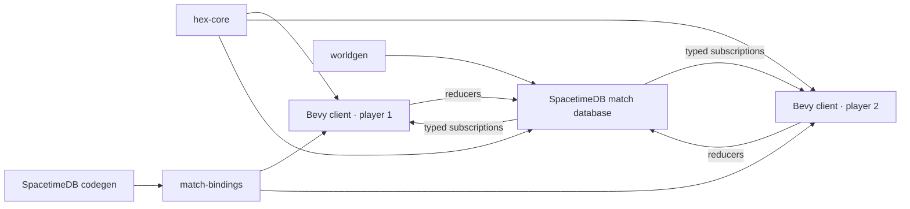

# V1 implementation guide

Status: playable implementation and engineering handoff

This document maps the agreed V1 design onto the code that implements it. The
game rules remain in [the V1 design](./v1-game-design.md); this file describes
the executable boundaries, operational flow, and intentional simplifications.

## Runtime topology



One SpacetimeDB host can run many databases. V1 manually provisions one logical
database per match; it does not require a host process per match. A future lobby
or orchestrator can create databases and assign players without changing the
match module's authority boundary.

## Authority and cadence

The Bevy client sends intentions only. The match module owns identity slots,
terrain, population, mobilization, ownership, force state, orders, routes,
movement, congestion, combat, capture, victory, receipts, and persistence.
Generated bindings are the typed wire contract and must not be edited manually.

This gameplay cutover changes the persisted order kind and public reducer
signatures. An older local development database cannot be migrated in place;
recreate it and regenerate bindings before connecting clients:

```bash
./scripts/publish-local.sh --fresh --confirm-delete-of-match-dev
```

The match starts after both identity-bound player slots are claimed. A private
scheduled table advances the simulation every 250 milliseconds. Movement and
combat operate on active packets/fronts/orders; the provisional one-second
population cadence scans habitable state. Client commands carry stable IDs and
produce public receipts, making retries idempotent. A reconnecting client reuses
its stored SpacetimeDB token, subscribes to a fresh snapshot, reclaims its slot,
and continues above the highest observed command ID.

Every committed infantry point is represented by its current cell plus order
allocation metadata. A logical step must satisfy:

```text
committed = in transit + delivered + casualties
```

Movement also enforces per-cell military capacity, per-edge throughput, and
passability. Combat separately enforces frontage and the uphill modifier.

## Authoritative tables

Public state is split by read/update pattern:

- `player_slot`, `match_config`, `match_state`, and `mobilization_policy` hold
  match-wide state;
- `cell_terrain` is immutable after lobby configuration;
- `cell_state` holds mutable ownership, population, infantry, and capacities;
- `command_receipt` records accepted and rejected idempotent commands;
- `transfer_order`, `transfer_source`, `transfer_destination`, and
  `transit_packet` expose generic internal aggregate-flow progress and
  congestion;
- `combat_front` exposes the current contested edges and casualties.

`simulation_schedule`, `expansion_wave`, and `expansion_garrison_debt` are
private. The wave row holds per-order inward/outward depth fields and fair-split
cursors. Sparse cell-keyed garrison debt ensures partial asynchronous arrivals
finish the full occupation cost before later wave strength branches, even when
another overlapping expansion supplies it. Pre-existing friendly transit cells
create no debt. Clients see only the resulting source accounting and
resting/one-edge packets. Clients cannot call the scheduled reducer as a player
identity.

## Public reducer surface

- `configure_map` — select Dev64, Playtest128, or Validation192 before joining.
- `join_match` — claim or reclaim one of the two player slots.
- `set_mobilization_target` — change the global target in basis points.
- `issue_push_front` — commit a percentage of one connected selected region
  through its one connected directional front. Corridor routes stay selected
  until the initial outward edge, after which each lane sustains movement along
  the exact stored axial direction using its fixed committed pool.
- `cancel_push_fronts` — stop matching active directional pushes and release
  remaining allocations where the troops currently are.
- `issue_expand_all` — commit a percentage of one connected selected region's
  currently unallocated infantry to every eligible neutral boundary. Sources
  split and merge through a depth-directed flow inside the selection, then
  continue through successive outward perimeter layers without retaining an
  axial direction.
- `cancel_expand_all` — stop matching active all-front expansion orders for the
  submitted source region and release their remaining allocations in place.
- `issue_balance` — create a percentage-aware physical density equalization
  order.
- `issue_front_load` — create a percentage-aware physical directional density
  order.
- `issue_core_load` — create a percentage-aware physical inward radial density
  order.
- `issue_perimeter_load` — create a percentage-aware physical outward radial
  density order.
There is no public precise-infantry-transfer reducer. The generic transfer
tables are execution machinery shared by Push Front, Expand All, and
redistribution, not a cell-targeting player command.

Rejected gameplay commands still create an authoritative receipt with a reason;
they do not partially mutate match state.

## Map contract

The shared generator currently pins three deterministic stepped-island maps:

| Preset | Dimensions | Capturable | Content hash |
| --- | ---: | ---: | --- |
| Dev | 64×64 | 2,395 | `3b9b9767ada36223` |
| Playtest | 128×128 | 9,657 | `894c50e9e590ddb9` |
| Validation | 192×192 | 21,484 | `40a19e2ad4608010` |

Generation validates bounds, completeness, capacity, spawns, land connectivity,
slopes, cliffs, and hash stability. JSON export uses an ordered cell array so it
round-trips without non-string map keys. V1 has no per-edge map overrides;
roads, rivers, bridges, and crossings require an explicit versioned edge array
later.

## Client structure

The native client renders combined chunk meshes rather than one entity per hex.
Each triangle retains its authoritative axial cell so ray picking selects the
visible stepped surface. Ownership hue and the active map-view intensity are
encoded in vertex colors; separate overlays communicate selection, target
density, route, bottlenecks, active flow, and combat fronts.

Contested targets still have exactly one authoritative controller and one local
infantry stack. The client aggregates subscribed `CombatFront` pressure, derives
an attacker share, and blends the controller and attacker colors in the
existing chunk vertex-color buffer. This adds no UI node, entity, or unique
material per contested cell and does not imply dual occupancy.

The default Soldiers view shades cells by absolute infantry strength rather
than capacity occupancy. Overview removes force-dependent luminance, and the
Civilians view shades by absolute civilian population. `1`, `2`, and `3`
select those views directly; `V` cycles them. Stable presentation reference
values keep an unrelated cell's color from changing when the map-wide maximum
changes. At readable zoom levels, one texture-atlas-backed world-space mesh
batches compact authoritative totals directly over their hex tops; there is no
UI node or draw call per cell. Farther out, the vertex-color heatmap carries the
information without trying to draw text for every cell. The label LOD is
viewport-derived and displays the complete readable visible set or hides it,
rather than silently sampling cells when a fixed budget is exceeded.
In Civilians mode, a second single-mesh batch draws thin quads across exposed
edges of six-connected populated land, with most of each strip kept on the
populated hex top. Its scan is limited to visible render chunks and its edge
budget is likewise complete-or-hidden; it does not create a UI element,
material, entity, or gizmo for every populated cell. Camera, projection,
visible-chunk, and cell-state signatures skip both value and perimeter scans on
unchanged frames.

Rendering work is organized by an 8 x 8 client-side spatial index. This is
deliberately independent of the module's 16 x 16 storage/subscription chunks so
the renderer can tune culling granularity without changing authoritative cell
identity. Initial render-chunk creation is amortized, state changes replace
only the affected vertex-color attributes, visible dirty chunks are
prioritized, and hidden chunks converge under a bounded per-frame budget.
The value batch, population outline, blocked overlay, and selected-region
perimeters inspect visible render-chunk cells rather than scanning the whole
map. Selection painting supports a centered odd-sized rectangular core with
complete hex-ring dilation up to 31 x 31 cells, connected local-owned
components, and all-local-owned selection. Width and height remain independently
adjustable while combined resizing adds or removes a true one-cell perimeter.
Large selections are materialized once in V1, but their per-frame outline work
is viewport-bounded and emits only exposed edges. Order previews are keyed by
selection and cell-state revisions. Push Front uses shared deterministic rules
to derive only the exact chosen-direction boundary, then checks reachability
backward through the selected region; it does not perform a route search for
every possible map destination. This keeps presentation work tied primarily to
the viewport and real state changes. World-scale maps will still
require symbolic region selections plus chunk-interest subscriptions or
regional summaries so the client does not retain or transmit every
authoritative cell.

Input produces `ClientIntent`. The online transport maps coordinates to
authoritative cell IDs, invokes reducers, pumps SpacetimeDB frames, and rebuilds
`MatchView` from subscribed tables. The offline transport implements the same
message boundary for UI development but is not a rules-equivalent substitute
for the server.

The V1 conquest interaction is Push Front: paint one connected owned region,
hold `P`, drag outward, and release to preview one exact direction. Plain
brackets adjust commitment and `Enter` submits. Selected cells facing non-owned
territory in that direction are the front; the other connected selected cells
are its reinforcement corridor. The server routes through that corridor, then
extends each lane through successive layers only along the chosen direction.
Terrain, elevation, throughput, frontage, enemies, and terrain-scaled garrisons
consume or delay its fixed committed pool. Lanes stop independently when
exhausted, blocked, defeated, at the map edge, or cancelled. With the same
front and direction previewed, `X` stops matching active pushes.

Shift+`P` (or `EXPAND ALL` in the HUD) skips orientation and previews every
eligible neutral edge around the connected selection. Plain brackets change
the order's dispatch percentage; this is independent of the mobilization
slider, which controls future recruitment. Each selected cell contributes that
share of its currently unallocated infantry once. Inside the selection, every
cell combines its local and incoming pools, then divides that strength evenly
among all traversable neighbors one depth closer to an eligible boundary.
Shared children merge contributions before splitting again. Boundary cells use
the same rule across their eligible neutral exits, and captured surplus repeats
it from perimeter depth `d` to `d + 1`. Branches progress independently, so the
result can bulge, but depth always moves monotonically and the operation cannot
cycle, skip layers, or preserve a straight-ray heading. Enemy targets are
excluded initially and rechecked during execution, so Expand All stops rather
than becoming an implicit attack. A captured cell consumes its full
terrain-scaled occupation garrison across partial arrivals before surplus
continues; already-friendly transit cells do not pay that cost. From the same
preview, `X` cancels matching Expand All orders.

`B`, `F`, `G`, and `R` preview Balance, directional Front-load, Core-load, and
Perimeter-load. Brackets adjust percentage participation for all four. The
unparticipating share of each selected cell's current stack remains frozen in
that cell; the shared integer allocator redistributes only the participating
pool and provides the client heatmap as well as the authoritative target plan.
Precise infantry destination painting is not part of the V1 loop; exact
cell-to-cell control is reserved for possible future discrete units.

## Tests and current evidence

- `hex-core` covers coordinates, chunks, traversal, routing, connectivity,
  selected directional- and all-front derivation, capacity, throughput,
  backpressure, conservation, multi-edge combat, redistribution, and exact 80%
  victory math.
- `worldgen` pins all curated maps, round-trips serialization, rejects invalid
  metadata/duplicates, and sweeps supported custom seeds.
- The module's native tests pin preset metadata; module compilation validates
  the SpacetimeDB schema and WASM target.
- The headless real-server smoke test uses two identities to cover slot claims,
  match start, subscriptions, idempotent receipts, sustained multi-layer Push
  progression, branching and direction-changing neutral Expand All wave
  progression, cancellation, and token-based reconnect. Deterministic module
  and client cases pin shared-child merging and asynchronous split fairness.
- The Bevy client has coordinate/fixture/route tests and a native launch smoke.
- CI repeats formatting, workspace tests/lints, module tests/lints/build, and
  generated-binding drift detection.

## Known V1 limits

- Infantry is the only force composition serialized by the module.
- The second join auto-starts the match; there is no lobby UI or ready toggle.
- Corridor routes and axial lane directions are deterministic and fixed when an
  order is accepted; sustained Push packets extend only along that ray and do
  not dynamically replan around later ownership changes. Expand All instead
  uses a deterministic depth-directed wave topology fixed by the accepted seed
  state; it has no retained axial heading.
- Push Front and Expand All convert the chosen dispatch percentage to
  authoritative basis points. There are no order priorities or adaptive lane
  retargeting. Expand All applies only to the submitted connected selection;
  the V1 4,096-cell command limit is not a world-scale global policy.
- Population/mobilization uses a provisional full-state cadence. Movement and
  combat use active sets, but nominal/stress performance gates still need
  representative playtest measurement.
- There is no retreat, morale, explicit supply penalty, HQ defeat, time limit,
  economy/upkeep, demobilization, infrastructure, fog, armor, naval/air force,
  diplomacy, AI, matchmaking, or production art.
- Mobilization already removes people from the civilian population, but V1 has
  no economic output to reduce and no army upkeep to pay. The recorded post-V1
  requirement is that soldiers impose both lost civilian labor and an explicit,
  ongoing economic burden.
- Native desktop is the supported V1 target. Bevy can target the web, but the
  filesystem-backed credential adapter and representative browser performance
  have not been implemented or qualified.

These are bounded omissions, not hidden placeholders. Candidate extensions and
their dependencies are recorded in [future ideas](./future-ideas.md).
