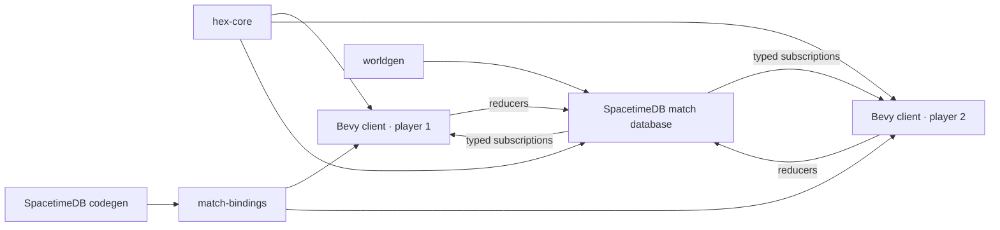

# V1 implementation guide

Status: playable implementation and engineering handoff

This document maps the agreed V1 design onto the code that implements it. The
game rules remain in [the V1 design](./v1-game-design.md); this file describes
the executable boundaries, operational flow, and intentional simplifications.

## Runtime topology



One SpacetimeDB host can run many databases. V1 manually provisions one logical
database per match; it does not require a host process per match. A future lobby
or orchestrator can create databases and assign players without changing the
match module's authority boundary.

## Authority and cadence

The Bevy client sends intentions only. The match module owns identity slots,
terrain, population, mobilization, ownership, force state, orders, routes,
movement, congestion, combat, capture, victory, receipts, and persistence.
Generated bindings are the typed wire contract and must not be edited manually.

The match starts after both identity-bound player slots are claimed. A private
scheduled table advances the simulation every 250 milliseconds. Movement and
combat operate on active packets/fronts/orders; the provisional one-second
population cadence scans habitable state. Client commands carry stable IDs and
produce public receipts, making retries idempotent. A reconnecting client reuses
its stored SpacetimeDB token, subscribes to a fresh snapshot, reclaims its slot,
and continues above the highest observed command ID.

Every committed infantry point is represented by its current cell plus order
allocation metadata. A logical step must satisfy:

```text
committed = in transit + delivered + casualties
```

Movement also enforces per-cell military capacity, per-edge throughput, and
passability. Combat separately enforces frontage and the uphill modifier.

## Authoritative tables

Public state is split by read/update pattern:

- `player_slot`, `match_config`, `match_state`, and `mobilization_policy` hold
  match-wide state;
- `cell_terrain` is immutable after lobby configuration;
- `cell_state` holds mutable ownership, population, infantry, and capacities;
- `command_receipt` records accepted and rejected idempotent commands;
- `transfer_order`, `transfer_source`, `transfer_destination`, and
  `transit_packet` expose order progress and congestion;
- `combat_front` exposes the current contested edges and casualties.

`simulation_schedule` is private. Clients cannot call the scheduled reducer as
a player identity.

## Public reducer surface

- `configure_map` — select Dev64, Playtest128, or Validation192 before joining.
- `join_match` — claim or reclaim one of the two player slots.
- `set_mobilization_target` — change the global target in basis points.
- `issue_transfer` — commit an absolute infantry amount from source IDs toward
  destination IDs.
- `issue_balance` — create a physical one-shot density equalization order.
- `issue_front_load` — create a physical one-shot directional density order.
- `cancel_transfer_order` — release the remaining allocation of an active
  order.

Rejected gameplay commands still create an authoritative receipt with a reason;
they do not partially mutate match state.

## Map contract

The shared generator currently pins three deterministic stepped-island maps:

| Preset | Dimensions | Capturable | Content hash |
| --- | ---: | ---: | --- |
| Dev | 64×64 | 2,395 | `3b9b9767ada36223` |
| Playtest | 128×128 | 9,657 | `894c50e9e590ddb9` |
| Validation | 192×192 | 21,484 | `40a19e2ad4608010` |

Generation validates bounds, completeness, capacity, spawns, land connectivity,
slopes, cliffs, and hash stability. JSON export uses an ordered cell array so it
round-trips without non-string map keys. V1 has no per-edge map overrides;
roads, rivers, bridges, and crossings require an explicit versioned edge array
later.

## Client structure

The native client renders combined chunk meshes rather than one entity per hex.
Each triangle retains its authoritative axial cell so ray picking selects the
visible stepped surface. Ownership hue and occupancy luminance are encoded in
vertex colors; separate overlays communicate selection, target density, route,
bottlenecks, active flow, and combat fronts.

Input produces `ClientIntent`. The online transport maps coordinates to
authoritative cell IDs, invokes reducers, pumps SpacetimeDB frames, and rebuilds
`MatchView` from subscribed tables. The offline transport implements the same
message boundary for UI development but is not a rules-equivalent substitute
for the server.

The order interaction is deliberately provisional: paint sources, enter a
modal transfer or redistribution preview, inspect the effect, and confirm. This
is the first workflow to playtest rather than a commitment to the final UX.

## Tests and current evidence

- `hex-core` covers coordinates, chunks, traversal, routing, connectivity,
  capacity, throughput, backpressure, conservation, multi-edge combat,
  redistribution, and exact 80% victory math.
- `worldgen` pins all curated maps, round-trips serialization, rejects invalid
  metadata/duplicates, and sweeps supported custom seeds.
- The module's native tests pin preset metadata; module compilation validates
  the SpacetimeDB schema and WASM target.
- The headless real-server smoke test uses two identities to cover slot claims,
  match start, subscriptions, idempotent receipts, a real transfer, progression,
  and token-based reconnect.
- The Bevy client has coordinate/fixture/route tests and a native launch smoke.
- CI repeats formatting, workspace tests/lints, module tests/lints/build, and
  generated-binding drift detection.

## Known V1 limits

- Infantry is the only force composition serialized by the module.
- The second join auto-starts the match; there is no lobby UI or ready toggle.
- Routes are deterministic and fixed when an order is accepted; active orders
  do not dynamically replan around later ownership changes.
- Transfers use an absolute aggregate amount after the client converts its
  percentage selection; there are no order priorities.
- Population/mobilization uses a provisional full-state cadence. Movement and
  combat use active sets, but nominal/stress performance gates still need
  representative playtest measurement.
- There is no retreat, morale, explicit supply penalty, HQ defeat, time limit,
  economy/upkeep, demobilization, infrastructure, fog, armor, naval/air force,
  diplomacy, AI, matchmaking, or production art.
- Mobilization already removes people from the civilian population, but V1 has
  no economic output to reduce and no army upkeep to pay. The recorded post-V1
  requirement is that soldiers impose both lost civilian labor and an explicit,
  ongoing economic burden.
- Native desktop is the supported V1 target. Bevy can target the web, but the
  filesystem-backed credential adapter and representative browser performance
  have not been implemented or qualified.

These are bounded omissions, not hidden placeholders. Candidate extensions and
their dependencies are recorded in [future ideas](./future-ideas.md).
