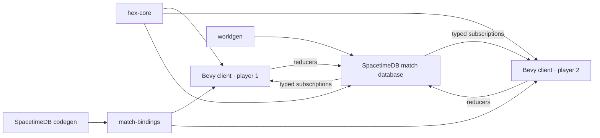

# V1 implementation guide

Status: playable implementation and engineering handoff

This document maps the agreed V1 design onto the code that implements it. The
game rules remain in [the V1 design](./v1-game-design.md); this file describes
the executable boundaries, operational flow, and intentional simplifications.

## Runtime topology



One SpacetimeDB host can run many databases. V1 manually provisions one logical
database per match; it does not require a host process per match. A future lobby
or orchestrator can create databases and assign players without changing the
match module's authority boundary.

## Authority and cadence

The Bevy client sends intentions only. The match module owns identity slots,
terrain, population, mobilization, ownership, force state, orders, routes,
movement, congestion, combat, capture, victory, receipts, and persistence.
Generated bindings are the typed wire contract and must not be edited manually.

This gameplay cutover changes the persisted order kind and public reducer
signatures. An older local development database cannot be migrated in place;
recreate it and regenerate bindings before connecting clients:

```bash
./scripts/publish-local.sh --fresh --confirm-delete-of-match-dev
```

The match starts after both identity-bound player slots are claimed. A private
scheduled table advances the simulation every 250 milliseconds. Movement and
combat operate on active packets/fronts/orders; the provisional one-second
population cadence scans habitable state. Client commands carry stable IDs and
produce public receipts, making retries idempotent. A reconnecting client reuses
its stored SpacetimeDB token, subscribes to a fresh snapshot, reclaims its slot,
and continues above the highest observed command ID.

Every committed infantry point is represented by its current cell plus order
allocation metadata. A logical step must satisfy:

```text
committed = in transit + delivered + casualties
```

Movement also enforces per-cell military capacity, per-edge throughput, and
passability. Combat separately enforces frontage and the uphill modifier.

## Authoritative tables

Public state is split by read/update pattern:

- `player_slot`, `match_config`, `match_state`, and `mobilization_policy` hold
  match-wide state;
- `cell_terrain` is immutable after lobby configuration;
- `cell_state` holds mutable ownership, population, infantry, and capacities;
- `cluster_policy_assignment` stores public per-cell policy lineage and explicit
  policy revisions; clusters themselves remain derived connected components;
- `command_receipt` records accepted and rejected idempotent commands;
- `transfer_order`, `transfer_source`, `transfer_destination`, and
  `transit_packet` expose generic internal aggregate-flow progress and
  congestion;
- `combat_front` exposes the current contested edges and casualties.

`simulation_schedule`, `expansion_wave`, and `expansion_garrison_debt` are
private. A wave stores its deterministic inward/outward topology, optional
neutral focus, immutable enemy target mask, and rotating fair-split cursors.
Sparse cell-keyed garrison debt ensures partial asynchronous arrivals finish the
full occupation cost before later strength branches, even when another wave
also reaches the cell. Pre-existing friendly transit cells create no debt.
Clients see only source accounting and resting/one-edge packets. Clients cannot
call the scheduled reducer as a player identity.

## Public reducer surface

The cluster-first client uses these gameplay reducers:

- `configure_map` — select Dev64, Playtest128, or Validation192 before joining.
- `join_match` — claim or reclaim one of the two player slots.
- `set_mobilization_target` — change the global recruitment target in basis
  points.
- `issue_expand_clusters` — expand every complete owned cluster touched by the
  source seeds across its full reachable neutral perimeter. The clicked neutral
  cell is a focus: deterministic 3/2/1 branch weights favor progress toward it
  without suppressing the rest of the perimeter.
- `issue_attack_clusters` — expand source and target seeds to complete owned
  and enemy clusters, snapshot the enemy target union, and start from every
  shared passable front. Captures reveal the next masked cells, so local branches
  can turn, split, and merge but can never leave the accepted targets.
- `set_cluster_policy` — persist Balanced, Center, Perimeter, or Directional
  policy on every complete selected source cluster. The policy is metadata, not
  a Share allocation; the authority immediately schedules any required
  capacity-safe redistribution of the free pool.
- `issue_reshape` — prioritize a drawn owned, passable destination shape for
  one complete source cluster using all available affected strength. Exact fits
  drain movable non-target strength; undersized targets saturate and conserve
  deterministic overflow outside.
- `cancel_orders` — atomically stop the exact explicit active-order IDs
  snapshotted from current intersections with the selected clusters; the V1
  Stop snapshot excludes background policy maintenance.

Both cluster action reducers accept sparse seed IDs and expand them
authoritatively. The client therefore cannot create a hidden sub-cluster action
by omitting cells. Share is a basis-point field only on expansion and attack;
it is applied once to action-available infantry in each participating source.
That pool includes stationary free strength and local yieldable policy strength
but excludes other explicit allocations. Sources without an eligible route or
shared front contribute nothing, and selecting several target clusters never
multiplies a source commitment.

`cluster_policy_assignment` stores per-cell policy lineage. Connected clusters
are derived from current ownership and traversal. On a split, both children keep
their cells' policy. On a merge, the greatest explicit revision wins
deterministically for the complete merged component; newly captured cells
inherit their connected cluster's policy.

Policy planning excludes strength in live action packets from both the movable
pool and the requested density calculation. Those packets still reserve the
capacity of their physical cells. This prevents policy maintenance from
counterbalancing against troops that are already expanding, attacking, or
reshaping, while also preventing overfill. Settled, completed, or cancelled
strength rejoins the free pool. An accepted explicit command atomically cancels
only intersecting background maintenance orders and can use their released
survivors; other explicit allocations remain fixed. The assignment rows persist,
so maintenance resumes from the same policy on a later pass. Background policy
packets blocked by capacity stay queued rather than completing at an
intermediate cell. Reconciliation replaces stale maintenance from current
physical positions and emits local relay handoffs through saturated connectors
when necessary. The replacement is prepared before the old maintenance is
cancelled, so failed planning preserves the live order. None of this reads
Share; that percentage remains exclusive to expansion and attack.

Reshape has the same accounting rule for unrelated allocations and has no Share
parameter. A disconnected source part without a reachable drawn target remains
unchanged. All planning is best effort but conservative: capacity and route
constraints can leave overflow outside the drawing, never drop strength, and
never move it through non-friendly cells.

Older reducers such as `issue_push_front`, `issue_expand_all`, and the
one-shot distribution reducers remain in the module as compatibility and
implementation-history surfaces. The V1 client does not expose their painted
sub-cluster or retask-handle grammar as the primary interaction.

Every gameplay intention carries a stable player-scoped command ID. Rejected
commands still create an authoritative receipt with a UI-suitable reason and do
not partially mutate match state.

## Map contract

The shared generator currently pins three deterministic stepped-island maps:

| Preset | Dimensions | Capturable | Content hash |
| --- | ---: | ---: | --- |
| Dev | 64×64 | 2,395 | `3b9b9767ada36223` |
| Playtest | 128×128 | 9,657 | `894c50e9e590ddb9` |
| Validation | 192×192 | 21,484 | `40a19e2ad4608010` |

Generation validates bounds, completeness, capacity, spawns, land connectivity,
slopes, cliffs, and hash stability. JSON export uses an ordered cell array so it
round-trips without non-string map keys. V1 has no per-edge map overrides;
roads, rivers, bridges, and crossings require an explicit versioned edge array
later.

## Client structure

The native client renders combined chunk meshes rather than one entity per hex.
Each triangle retains its authoritative axial cell so ray picking resolves the
visible stepped surface. Ownership hue and the active map-view intensity are
encoded in vertex colors; separate batched overlays communicate cluster
selection, target clusters, intended Reshape footprint, active flows, combat
fronts, congestion, and blocked paths.

The default Soldiers view shades cells by absolute infantry strength rather than
capacity occupancy. Overview removes force-dependent luminance, and Civilians
shades absolute population. `1`, `2`, and `3` select those views; `V`
cycles them. Stable reference values keep an unrelated cell's color from
changing when the map-wide maximum changes. Readable close-zoom totals and
civilian perimeters are viewport-bounded batches, not a UI entity or draw call
per cell.

Rendering uses an 8 x 8 client-side spatial index independently of the module's
16 x 16 storage chunks. Initial chunk creation is amortized; state changes
replace only affected vertex colors; visible dirty chunks are prioritized; and
hidden chunks converge under a bounded budget. Selection and target outlines
inspect visible render chunks and emit exposed edges only.

### Cluster selection and reconciliation

`C` selects the complete owned, passable component under the cursor.
Shift+`C` adds a component, Control+`C` removes one, and
Control/Command+`A` selects all owned traversable components, including empty
owned cells. Empty owned cells may connect troop-bearing areas; blocked cells
and impassable cliff edges split them.

The interaction resource stores a materialized selected-cell set for V1, but
selection semantics remain whole-cluster. Reconciliation after subscription
updates absorbs owned growth and merges. If a selected cluster splits, every
still-owned resulting child remains selected. Ordinary selection never snapshots
a retask handle, adopts an active packet, or cancels a live order.

Large selections retain the 32,768-cell current-world command limit.
World-scale play will need symbolic component or chunk masks plus authority
revalidation rather than transmitting millions of IDs.

### Contextual cluster actions

With source clusters selected, idle left-click is contextual:

- neutral ground emits `ExpandClusters` with the clicked coordinate as a focus;
- enemy ground emits `AttackClusters` for the complete enemy component;
- Shift-click toggles additional enemy components in a staged target union;
- Control-click removes a staged target;
- a plain enemy click adds its component and submits the union, while `Enter`
  submits an already staged union.

Source selection remains after a successful command so the player can continue
operating the same clusters. Staged targets clear after submission. Rejections
preserve authoritative state and surface the receipt reason.

The online adapter converts coordinates to cell IDs and invokes the cluster
reducers. The server expands sparse source and target seeds back to complete
current components, making the reducer contract independent of any stale client
snapshot. The offline adapter implements the same intent boundary for interface
work but is not a rules-equivalent substitute for authoritative timing, combat,
or persistence.

`[` and `]` change one persisted Share. Only contextual expansion and attack
read it. Preview and HUD accounting use each source's action-available infantry
once (stationary free strength plus local yieldable policy strength, excluding
other explicit allocations); multiple shared fronts or staged targets do not
duplicate the source base.

### Persistent policy, Reshape, and Stop

`R` cycles selected clusters among Balanced, Perimeter, and Center.
Holding `F`, dragging, and releasing writes Directional policy with the exact
fixed-point axial vector used by the server. Subscribed
`cluster_policy_assignment` rows rebuild the policy view; missing owned rows
display the revision-zero Balanced default.

Policy is not a pending one-shot command and is never multiplied by Share. The
server redistributes only the free pool while excluding live action packets from
the policy target calculation and reserving the capacity those packets occupy.
The HUD reports the selected policy, or mixed policy when selected clusters
differ.

`T` enters Reshape only when exactly one source cluster is selected. Left-drag
draws an owned, passable desired troop footprint and release builds a best-effort
preview. The brush supports independent width and height plus symmetric ring
growth. Its overlay always distinguishes available cells, unavailable in-map
cells, and positions outside the world so the intended shape remains legible at
boundaries. Reshape uses the whole available pool, never Share.

`X` freezes the exact explicit active-order IDs whose current allocations
intersect the selected clusters. Background policy-maintenance orders are
excluded. Confirmation cancels only that snapshot and leaves policy metadata
enabled. `Escape` backs out of staged attack targets, Reshape, or Stop; while
idle it clears selection. Selection never supersedes an explicit order; an
accepted contextual action yields intersecting background maintenance only.

### HUD and transport state

The HUD is a compact text-only, keybind-first contextual strip with no command
grid. Idle state shows cluster selection, Share, policy, and the few current
keys. Attack staging, Directional policy, Reshape drawing, exact Stop,
invalid state, and locked submission each replace that copy with their relevant
instructions. `?` toggles the complete field manual. The right panel remains
a compact map-view, inspector, and order summary.

Input produces `ClientIntent`. The online transport invokes generated typed
reducers, pumps SpacetimeDB frames, and rebuilds `MatchView` from subscribed
tables including cluster policy. Stable command IDs and receipts make retry
observation idempotent. Reconnect discards speculative UI state and rebuilds the
selection-adjacent presentation from the new authoritative snapshot.

## Tests and current evidence

- `hex-core` covers coordinates, traversal, routing, connectivity, capacity,
  throughput, conservation, combat, redistribution, focused branch weights,
  exact integer allocation, rotating fairness, and Conquest math.
- Module tests cover authority expansion from sparse seeds to complete source
  and target clusters, Share-once accounting, all-shared-front attack topology,
  immutable target containment, terrain/capacity/garrison constraints, policy
  split/merge/capture lineage, live-packet exclusion with physical capacity
  reservation, atomic background-maintenance yield, queued policy congestion,
  saturated-connector relay, and shared-relay coalescing.
- Client interaction tests cover whole-cluster selection, modifiers and Select
  All, reconciliation after growth/merge/split, contextual neutral and enemy
  clicks, staged enemy unions, persistent-policy keys, single-cluster Reshape,
  explicit-only Stop, policy yield previews, and submission/rejection state.
- `worldgen` pins all curated maps, round-trips serialization, rejects invalid
  metadata/duplicates, and sweeps supported custom seeds.
- The real-server two-identity harness covers slot claims, match start,
  subscriptions, idempotent receipts, public cluster actions and policies,
  conserved movement, cancellation, and reconnect.
- CI repeats formatting, workspace tests/lints, module tests/lints/build, and
  generated-binding drift detection.

## Known V1 limits

- Infantry is the only force composition serialized by the module.
- The second join auto-starts the match; there is no lobby UI or ready toggle.
- Expansion topology is deterministic from the accepted state. The focus changes
  branch allocation but is not a continuously replanned destination.
- Attack snapshots complete enemy target clusters at acceptance. Fronts evolve
  within that mask, but later growth of the enemy cluster is not silently added
  and the wave never retargets another cluster.
- Cluster policies have no priorities, minimum garrisons, or conditional
  automation beyond Balanced, Center, Perimeter, and one Directional facing.
  Their deliberate scope is redistribution of the currently free pool.
- Reshape is confined to one selected owned cluster and owned passable target
  cells. It does not use drawing as an alternative conquest command.
- The 32,768-cell materialized-selection limit is not a world-scale policy or
  region-selection architecture.
- Population/mobilization uses a provisional full-state cadence and leaves
  military headroom for unreceived active internal-order destinations.
  Movement and combat use active sets, but nominal/stress performance gates
  still need representative playtest measurement.
- There is no morale, explicit supply penalty, HQ defeat, time limit,
  economy/upkeep, demobilization, infrastructure, fog, armor, naval/air force,
  diplomacy, AI, matchmaking, or production art.
- Mobilization already removes people from the civilian population, but V1 has
  no economic output to reduce and no army upkeep to pay. The recorded post-V1
  requirement is that soldiers impose both lost civilian labor and an explicit,
  ongoing economic burden.
- Native desktop is the supported V1 target. Bevy can target the web, but the
  filesystem-backed credential adapter and representative browser performance
  have not been implemented or qualified.

These are bounded omissions, not hidden placeholders. Candidate extensions and
their dependencies are recorded in [future ideas](./future-ideas.md).
