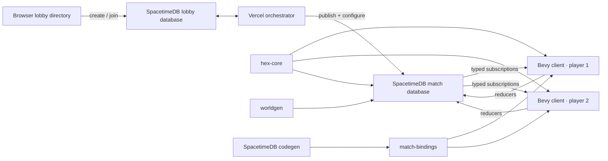

# V1 implementation guide

Status: playable implementation and engineering handoff

This document maps the agreed V1 design onto the code that implements it. The
game rules remain in [the V1 design](./v1-game-design.md); this file describes
the executable boundaries, operational flow, and intentional simplifications.

## Runtime topology



One SpacetimeDB host can run many databases. Local development manually
provisions one logical database per match. Production publishes a small lobby
control module and uses a Vercel function to create `of-match-<lobby-id>`
databases from the pinned match Wasm, configure them once, and assign browsers
without changing the match module's authority boundary.

## Authority and cadence

The Bevy client sends intentions only. The match module owns identity slots,
terrain, population, mobilization, ownership, force state, orders, routes,
movement, congestion, combat, capture, victory, receipts, and persistence.
Generated bindings are the typed wire contract and must not be edited manually.

This gameplay cutover changes the persisted order kind and public reducer
signatures. An older local development database cannot be migrated in place;
recreate it and regenerate bindings before connecting clients:

```bash
./scripts/publish-local.sh --fresh --confirm-delete-of-match-dev
```

The match starts after every configured identity-bound player slot is claimed
(verified seat count equals `player_count`; both fresh claims and recovered/
repaired identity joins recompute `claimed_players` from verified seats and may
start Running—no preliminary counter bump). A private scheduled table
advances the simulation every 250 milliseconds as one atomic tick. Movement and
combat operate on the complete active packet set; route/source loading is
scoped via `source_by_order` to packet order IDs and active transfer orders
(covering queued sources with no packet yet) without sharding shared combat.
Low-scale matches (`player_count <= 8`) keep the historical full population scan
every population interval; high-scale matches shard population by denormalized
`population_shard` so each cell still updates once per interval while work stays
bounded. Client commands carry stable IDs and produce public receipts, making
retries idempotent. A reconnecting client reuses its stored SpacetimeDB token,
recovers its seat from `player_identity` and/or slot identity (repairing a
missing index without a new claim, then reconciling verified claims so a
repaired final seat can start the lobby), clears generation-scoped pending
deltas and stale tactical presentation immediately, subscribes to a fresh
snapshot, and continues above the highest observed command ID.

Every committed infantry point is represented by its current cell plus order
allocation metadata. A logical step must satisfy:

```text
committed = in transit + delivered + casualties
```

Movement also enforces per-cell military capacity, per-edge throughput, and
passability. Combat separately enforces frontage and the uphill modifier.

## Authoritative tables

Public state is split by read/update pattern:

- `player_slot`, `player_identity`, `player_state`, `match_config`, `match_state`,
  and `mobilization_policy` hold match-wide state. Authoritative player IDs are
  `u16` with neutral `0` and configured seats `1..=player_count` (`2..=500`);
- `cell_terrain` is immutable after lobby configuration;
- `cell_state` holds mutable ownership, population, infantry, capacities, a
  deterministic `population_shard` (`u16`, validated against the interval), and
  denormalized `chunk_q`/`chunk_r` for high-scale spatial interest;
- `command_receipt` records accepted and rejected idempotent commands;
- `transfer_order`, `transfer_source`, `transfer_destination`, `transit_route`,
  and `transit_packet` expose generic internal aggregate-flow progress and
  congestion. Child source/destination/route rows denormalize `player_id` so
  high-scale clients can subscribe selectively by seat;
- `combat_front` exposes the current contested edges and casualties.

`simulation_schedule`, `expansion_wave`, and `expansion_garrison_debt` are
private. A wave stores its deterministic outward topology, participating
perimeter cells, optional
neutral focus, immutable enemy target mask, and rotating fair-split cursors.
Sparse cell-keyed garrison debt ensures partial asynchronous arrivals finish the
full occupation cost before later strength branches, even when another wave
also reaches the cell. Pre-existing friendly transit cells create no debt.
Clients see only source accounting and resting/one-edge packets. Clients cannot
call the scheduled reducer as a player identity.

## Public reducer surface

The cluster-first client uses these gameplay reducers:

- `configure_map` — make the lobby's one-shot map selection while retaining the configured player count.
- `configure_match` — make the lobby's one-shot map and 2–500 contiguous-player selection. Configuration locks further regeneration but does not claim a slot.
- `join_match` — separately claim or reclaim one of the configured player slots; every slot remains open after configuration.
- `set_mobilization_target` — change the global recruitment target in basis
  points.
- `issue_expand_clusters` — expand every complete owned cluster touched by the
  source seeds across its full reachable neutral perimeter. The clicked neutral
  cell is a focus: mild deterministic 11/10/9 branch weights favor progress
  toward it without suppressing the rest of the perimeter. Only troops already
  on eligible neutral-facing perimeter cells participate.
- `issue_attack_clusters` — expand source and target seeds to complete owned
  and enemy clusters, snapshot the enemy target union, and start from every
  shared passable front using only troops stationed on that front. Captures reveal the next masked cells, so local branches
  can turn, split, and merge but can never leave the accepted targets.
- `issue_front_rebalance` — move one Share of movable troops from a selected
  strategic front to another front of the same complete owned cluster.
- `issue_reshape` — prioritize a drawn owned, passable destination shape for
  one complete source cluster using all available affected strength. Exact fits
  drain movable non-target strength; undersized targets saturate and conserve
  deterministic overflow outside.
- `cancel_orders` — atomically stop the exact explicit active-order IDs
  snapshotted from current intersections with the selected clusters.

Cluster reducers accept sparse seed IDs and expand them authoritatively. The
client therefore cannot create a hidden sub-cluster action by omitting cells.
Share is a basis-point field on expansion, attack, and Front Rebalance; it is
applied once to stationary action-available infantry in each participating
perimeter/front source. Inland cells contribute nothing until explicitly
rebalanced. Existing explicit allocations remain fixed and reserve their physical
capacity.

Front Rebalance derives current strategic arcs from authoritative ownership and
traversal. It computes capacity-safe target placement and terrain-aware routes
once, then persists explicit aggregate packets. No policy metadata, density
cache, or periodic redistribution state exists.

Reshape has the same accounting rule for unrelated allocations and has no Share
parameter. A disconnected source part without a reachable drawn target remains
unchanged. All planning is best effort but conservative: capacity and route
constraints can leave overflow outside the drawing, never drop strength, and
never move it through non-friendly cells.

Older reducers such as `issue_push_front` and `issue_expand_all` remain in the
module as compatibility and implementation-history surfaces. The V1 client does not expose their painted
sub-cluster or retask-handle grammar as the primary interaction.

Every gameplay intention carries a stable player-scoped command ID. Rejected
commands still create an authoritative receipt with a UI-suitable reason and do
not partially mutate match state.

## Map contract

The shared generator currently pins three deterministic stepped-island maps:

| Preset | Dimensions | Capturable | Content hash |
| --- | ---: | ---: | --- |
| Dev | 64×64 | 2,395 | `3b9b9767ada36223` |
| Playtest | 128×128 | 9,657 | `894c50e9e590ddb9` |
| Validation | 192×192 | 21,484 | `40a19e2ad4608010` |

Generation validates bounds, completeness, capacity, spawns, land connectivity,
slopes, cliffs, and hash stability. JSON export uses an ordered cell array so it
round-trips without non-string map keys. V1 has no per-edge map overrides;
roads, rivers, bridges, and crossings require an explicit versioned edge array
later.

The offline [`worldgen` V2 pipeline](./worldgen-v2.md) now provides that
separate layered contract, including hydrology overlays, sparse edge features,
custom dimensions, chunk extraction, and large-map validation. It is not yet an
authoritative match preset: V1 hashes and bindings stay pinned until the
runtime adopts immutable terrain chunks and the remaining simulation/client
scale work described in that document.

## Client structure

The native client renders combined chunk meshes rather than one entity per hex.
Each triangle retains its authoritative axial cell so ray picking resolves the
visible stepped surface. Ownership hue and the active map-view intensity are
encoded in vertex colors; separate batched overlays communicate cluster
selection, target clusters, intended Reshape footprint, active flows, combat
fronts, congestion, and blocked paths.

The default Soldiers view shades cells by absolute infantry strength rather than
capacity occupancy. Overview removes force-dependent luminance, and Civilians
shades absolute population. `1`, `2`, and `3` select those views; `V`
cycles them. Stable reference values keep an unrelated cell's color from
changing when the map-wide maximum changes. Readable close-zoom totals and
civilian perimeters are viewport-bounded batches, not a UI entity or draw call
per cell.

Rendering uses an 8 x 8 client-side spatial index independently of the module's
16 x 16 storage chunks. Initial chunk creation is amortized; state changes
replace only affected vertex colors; visible dirty chunks are prioritized; and
hidden chunks converge under a bounded budget. Selection and target outlines
inspect visible render chunks and emit exposed edges only.

### Cluster selection and reconciliation

`C` selects the complete owned, passable component under the cursor.
Shift+`C` adds a component, Control+`C` removes one, and
Control/Command+`A` selects all owned traversable components, including empty
owned cells. Empty owned cells may connect troop-bearing areas; blocked cells
and impassable cliff edges split them.

The interaction resource stores a materialized selected-cell set for V1, but
selection semantics remain whole-cluster. Reconciliation after subscription
updates absorbs owned growth and merges. If a selected cluster splits, every
still-owned resulting child remains selected. Ordinary selection never snapshots
a retask handle, adopts an active packet, or cancels a live order.

Large selections retain the 32,768-cell current-world command limit.
World-scale play will need symbolic component or chunk masks plus authority
revalidation rather than transmitting millions of IDs.

### Contextual cluster actions

With source clusters selected, idle left-click is contextual:

- neutral ground emits `ExpandClusters` with the clicked coordinate as a focus;
- enemy ground emits `AttackClusters` for the complete enemy component;
- Shift-click toggles additional enemy components in a staged target union;
- Control-click removes a staged target;
- a plain enemy click adds its component and submits the union, while `Enter`
  submits an already staged union.

Source selection remains after a successful command so the player can continue
operating the same clusters. Staged targets clear after submission. Rejections
preserve authoritative state and surface the receipt reason.

The online adapter converts coordinates to cell IDs and invokes the cluster
reducers. The server expands sparse source and target seeds back to complete
current components, making the reducer contract independent of any stale client
snapshot. The offline adapter implements the same intent boundary for interface
work but is not a rules-equivalent substitute for authoritative timing, combat,
or persistence.

`[` and `]` change one persisted Share. Contextual expansion, attack, and
Front Rebalance read it. Preview and HUD accounting use each source's stationary
action-available infantry once; multiple shared fronts or staged targets do not
duplicate the source base.

### Front Rebalance, Reshape, and Stop

`B` enters Front Rebalance for one complete selected cluster. Dragging from one
strategic-front boundary cell to another creates one explicit Share-based
movement command. The preview highlights source and target arcs.

`T` enters Reshape only when exactly one source cluster is selected. Left-drag
draws an owned, passable desired troop footprint and release builds a best-effort
preview. The brush supports independent width and height plus symmetric ring
growth. Its overlay always distinguishes available cells, unavailable in-map
cells, and positions outside the world so the intended shape remains legible at
boundaries. Reshape uses the whole available pool, never Share.

`X` freezes the exact explicit active-order IDs whose current allocations
intersect the selected clusters. Confirmation cancels only that snapshot.
`Escape` backs out of staged attack targets, Front Rebalance, Reshape, or Stop;
while idle it clears selection. Selection never supersedes an explicit order.

### HUD and transport state

The HUD is a compact text-only, keybind-first contextual strip with no command
grid. Idle state shows cluster selection, Share, and the few current keys.
Attack staging, Front Rebalance, Reshape drawing, exact Stop,
invalid state, and locked submission each replace that copy with their relevant
instructions. `?` toggles the complete field manual. The right panel remains
a compact map-view, inspector, and order summary.

When authoritative state reports victory, a centered result overlay names the
winner, distinguishes local victory from defeat, and records the resolving
logical step. `Escape` returns web players to the lobby directory (where they
can leave the lobby) and exits the native client. The directory captures a
final member's provisioned match database before deleting its lobby row, then
best-effort deletes the database without failing that completed leave.

Input produces `ClientIntent`. The online transport invokes generated typed
reducers, pumps SpacetimeDB frames, and rebuilds `MatchView` from subscribed
authoritative tables. Stable command IDs and receipts make retry
observation idempotent. Reconnect discards speculative UI state and rebuilds the
selection-adjacent presentation from the new authoritative snapshot.

## Tests and current evidence

- `hex-core` covers coordinates, traversal, routing, connectivity, capacity,
  throughput, conservation, combat, redistribution, focused branch weights,
  exact integer allocation, rotating fairness, and Conquest math.
- Module tests cover authority expansion from sparse seeds to complete source
  and target clusters, Share-once accounting, all-shared-front attack topology,
  immutable target containment, terrain/capacity/garrison constraints,
  front-rebalance routing, live-packet exclusion, and physical capacity
  reservation.
- Client interaction tests cover whole-cluster selection, modifiers and Select
  All, reconciliation after growth/merge/split, contextual neutral and enemy
  clicks, staged enemy unions, Front Rebalance, single-cluster Reshape,
  explicit Stop, and submission/rejection state.
- `worldgen` pins all curated maps, round-trips serialization, rejects invalid
  metadata/duplicates, and sweeps supported custom seeds.
- The real-server two-identity harness covers slot claims, match start,
  subscriptions, idempotent receipts, public cluster actions,
  conserved movement, cancellation, and reconnect. Optional
  `--reconnect-only` / `--reconnect-cycles` soaks record reclaim latency;
  see [Browser release gates](./browser-gates.md).
- The distributed `match-perf` harness (`coordinator` / `worker` / `run-local`)
  profiles client-observed step dilation under multi-process load through 500
  seats; see [Performance profiling](./performance.md).
- CI repeats formatting, workspace tests/lints, module tests/lints/build, and
  generated-binding drift detection. Production deploy enforces the web-bundle
  size gate after Trunk build.

## Known V1 limits

- Infantry is the only force composition serialized by the module.
- Lobby create/join/start is implemented; empty lobbies can be cleaned up by
  leave/auto-delete flows. Match configuration remains one-shot per database.
- Expansion topology is deterministic from the accepted state. The focus changes
  branch allocation but is not a continuously replanned destination.
- Attack snapshots complete enemy target clusters at acceptance. Fronts evolve
  within that mask, but later growth of the enemy cluster is not silently added
  and the wave never retargets another cluster.
- Strategic fronts do not yet have durable IDs or persistent per-front quotas;
  topology changes require a new explicit rebalance gesture.
- Reshape is confined to one selected owned cluster and owned passable target
  cells. It does not use drawing as an alternative conquest command.
- The 32,768-cell materialized-selection limit is not a world-scale policy or
  region-selection architecture.
- Population/mobilization uses a provisional full-state cadence and leaves
  military headroom for unreceived active internal-order destinations.
  Movement and combat use active sets, but nominal/stress performance gates
  still need representative playtest measurement.
- There is no morale, explicit supply penalty, HQ defeat, time limit,
  economy/upkeep, demobilization, infrastructure, fog, armor, naval/air force,
  diplomacy, AI, matchmaking, or production art.
- Mobilization already removes people from the civilian population, but V1 has
  no economic output to reduce and no army upkeep to pay. The recorded post-V1
  requirement is that soldiers impose both lost civilian labor and an explicit,
  ongoing economic burden.
- Native desktop and WebAssembly/WebGPU compile targets are supported. The web
  target uses `localStorage` credentials and asynchronous browser networking;
  representative browser performance is not yet qualified for production. See
  [Browser release gates](./browser-gates.md) for budgets, the Wasm size
  baseline, and the remaining WebGPU / reconnect evidence checklist.

These are bounded omissions, not hidden placeholders. Candidate extensions and
their dependencies are recorded in [future ideas](./future-ideas.md).
