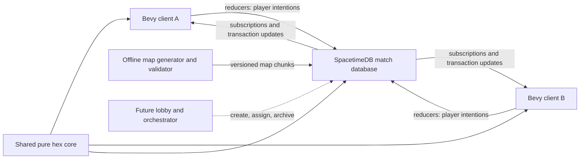

# Technical Architecture

Status: V1 architecture baseline
Last updated: 2026-08-02

This document records the architecture commitments for the first playable version of the game. It deliberately separates those commitments from scaling questions that must be answered with measurements. Gameplay details live elsewhere; this document focuses on authority, state flow, code boundaries, rendering, persistence, and delivery order.

## V1 commitments

- The game ships native desktop first with a Bevy client.
- Platform-dependent code stays behind narrow adapters so the client and shared game logic remain viable for a later WebAssembly build.
- SpacetimeDB is the sole gameplay authority. Clients submit intentions and render subscribed state; they do not run an authoritative lockstep simulation or vote on state hashes.
- Each match runs in its own logical SpacetimeDB database instance. This is isolation inside a SpacetimeDB host, not a requirement for one machine or process per match.
- V1 starts with one manually provisioned development match database. A lobby database and external match orchestrator are added when concurrent public matches are needed.
- One visible terrain hex is one authoritative gameplay cell. Terrain is static during a V1 match and is stored and rendered in chunks.
- Troops are conserved aggregate strength, not individual infantry entities. Transfers and combat operate on active orders and active front edges rather than scanning every cell.
- Authoritative calculations use integers or explicit fixed-point values with stable iteration order. Floating point is reserved for client presentation.
- Generated SpacetimeDB bindings define the client/server wire contract and are never edited by hand.
- V1 supports configurable map dimensions. The nominal load target is approximately 192 x 192 cells, with smaller development maps and a 256 x 256 stretch target.
- Initial visuals are procedural graybox geometry with clear ownership, elevation, selection, route, and troop-density feedback.

## Version and pinning policy

At the time of this decision, Bevy 0.19 is the selected Bevy baseline. The local machine has SpacetimeDB CLI and library 2.0.1 installed, which is behind the current 2.x release line. These numbers are planning inputs, not yet a tested compatibility matrix; the compatibility spike must select and pin an exact current SpacetimeDB toolchain rather than trusting a version written in this document indefinitely.

Before scaffolding gameplay code, run a small compatibility spike that:

1. upgrades or deliberately retains the SpacetimeDB CLI;
2. compiles and publishes a minimal Rust match module;
3. generates Rust client bindings from that module;
4. connects a Bevy 0.19 native client and receives a subscription update;
5. checks the client crate for `wasm32-unknown-unknown` without claiming browser support prematurely.

After that spike, pin the tested Rust toolchain and exact compatible crate versions in `rust-toolchain.toml`, workspace dependency declarations, and `Cargo.lock`. Keep the SpacetimeDB CLI, module SDK, client SDK, and binding generator on a tested compatible set. Upgrade Bevy or SpacetimeDB intentionally on a dedicated branch, regenerate bindings, run migrations if required, and repeat native, WASM-compile, reconnect, and load tests.

Useful release references:

- [Bevy 0.19 release](https://bevy.org/news/bevy-0-19/)
- [SpacetimeDB releases](https://github.com/clockworklabs/SpacetimeDB/releases)

## System topology



The client owns input, camera, rendering, local previews, interpolation, and UI. The match database owns player slots, authoritative terrain metadata, ownership, troop strength, orders, routing results, transfer progress, combat, and victory. The shared core contains deterministic rules used by both sides, but server execution always wins when a client preview differs.

This architecture does not copy OpenFront's client-side lockstep or client-majority hash model. OpenFront remains interaction and game-design research only. SpacetimeDB transactions and reducers provide the authority boundary suited to this stack.

## Database topology and match lifecycle

### First playable version

Publish the match module manually as one development database, for example `match-dev`. It hosts exactly one two-player match at a time. This avoids building a lobby before the transfer and conquest loop has been validated.

### Concurrent matches

When concurrent sessions are required, add:

- a small control or lobby database containing accounts, queues, invitations, match assignments, module versions, and final results;
- an external orchestrator that creates a logical match database from a pinned module version, initializes its map and settings, and gives both clients the database identity;
- archival and retention policy for completed match databases.

A logical database per match gives independent state, scheduling, subscriptions, module-version pinning, failure scope, and cleanup. Many such databases may run on one SpacetimeDB host. A single giant multi-match schema is not the default because it couples memory pressure, upgrades, security filters, and failure impact across otherwise independent games.

The match result is small and may be copied to the lobby after completion. The completed match state should become read-only before archival. Do not update a live match to a new module version unless a tested, compatible migration path exists.

## Proposed Cargo workspace

The initial repository layout should be close to:

```text
Cargo.toml
Cargo.lock
rust-toolchain.toml
crates/
  hex-core/             # Pure deterministic coordinates and game rules
  match-bindings/       # Generated SpacetimeDB Rust client bindings
  game-client/          # Bevy application and platform adapters
modules/
  match/                # SpacetimeDB schema, reducers, and scheduling
tools/
  mapgen/               # Offline generation, validation, and baking
  load-client/          # Headless scripted clients and load scenarios
assets/
maps/
docs/
```

`hex-core` must not depend on Bevy or SpacetimeDB. It owns value types and pure functions for axial/cube coordinates, neighbors, distance, chunk addressing, elevation traversal, connectivity, capacity and edge rules, route-cost primitives, combat math, conquest accounting, and deterministic seeded decisions. Both the module and client may depend on it. Client use is for previews, visualization, and tests, never client authority.

The SpacetimeDB module owns schema-facing wrappers, database queries, identity checks, reducers, transactions, indexes, active-set scheduling, and conversion to and from `hex-core` types. The Bevy client owns ECS presentation types and conversion from generated bindings.

Generate `match-bindings` from the published or locally built match module schema. Generated files carry a prominent generated marker, are not manually edited, and are either committed or reproducibly generated before build. CI must regenerate them and fail on an unexpected diff so schema drift is visible.

## Authoritative command and state flow

Clients send intentions such as:

- join or reclaim a player slot;
- select a spawn/start position when the mode requires it;
- issue, retarget, cancel, or reprioritize an aggregate transfer;
- commit troops to an enemy destination or active border;
- acknowledge readiness or request a rematch.

An intention contains a stable player-scoped command ID. Its reducer verifies connection identity, player slot, match phase, source ownership, available strength, destination validity, and rule-specific constraints in one transaction. Accepted intentions create or change authoritative orders. Rejected intentions return a reason suitable for UI display without changing game state.

The client never sends a resulting troop count, ownership result, casualty value, arrival time, or victory result. It may predict a path and ETA, but the reducer computes or validates the authoritative route and cost. Visual interpolation is allowed; speculative gameplay state must be clearly replaceable by the next subscription update.

Use a receipt or stable order row keyed by `(player_id, client_command_id)` to make retries idempotent. This matters when a client loses its connection after submission but before observing the committed transaction.

## Deterministic simulation rules

Authoritative simulation values use integer units or named fixed-point wrappers:

- troop strength and capacity: integer strength units;
- ratios and modifiers: fixed-point basis points or another documented scale;
- elevation: integer levels;
- duration: integer logical ticks;
- map coordinates and stable IDs: integers.

Do not use `f32` or `f64` for authoritative combat, routing cost, capacity, or conquest percentages. Specify rounding direction at each operation, use checked arithmetic where overflow indicates a bug, and test all boundary values.

When processing sets, sort by stable IDs or use ordered collections. Never let hash-map iteration decide combat or congestion priority. Derive randomness from a stored match seed plus stable event identifiers, and record any advanced random-stream state. The scheduler's wall clock wakes the simulation; it does not become an uncontrolled input to combat math.

Keep a logical simulation step counter in database state. A service interruption resumes from stored logical state rather than applying hours of combat instantly. If an optional wall-clock match limit is later enabled, its pause/recovery behavior must be an explicit game-mode rule.

## Aggregate transfers, congestion, and combat

Every troop strength unit is accounted for as stationary, assigned to an aggregate order at a cell, or removed as a casualty. There is no entity or database row per infantry member.

The V1 model distinguishes:

- hex capacity: strength that may be staged in a cell;
- edge throughput: strength per logical second that may cross an edge;
- combat frontage: strength that may engage across a hostile edge at one time.

These share a common strength scale but remain separate values. A city may later increase staging capacity, a road may increase throughput, and a mountain pass may constrain throughput and frontage without conflating all three effects.

An aggregate transfer order stores its owner, sources, destinations, committed amount, route or routing policy, priority, and status. Active flow state stores scalar queues at relevant cells or edges. On each logical step, approved movement is bounded by:

```text
min(queued strength, edge throughput * step duration, destination free capacity)
```

Movement uses a two-phase calculation: approve outgoing flow first, then commit incoming flow atomically. This permits a full column to advance as a pipeline without violating end-of-step capacity. Opposite flows of identical friendly infantry may be netted rather than pointlessly swapping identities. Overflow stays in the preceding cell and remains visible as congestion; it is never dropped.

Hostile forces do not coexist in a V1 cell. Combat occurs on active hostile edges. Frontage limits the committed strength that can participate at once, and defenders are allocated once across simultaneous hostile edges rather than duplicated against every attacker. After defenders reach zero, attackers enter subject to edge throughput and destination capacity, then ownership changes according to the combat rule.

### Scheduled and active-set processing

Use SpacetimeDB scheduling to wake the match simulation only while delayed work exists. Maintain explicit indexed active sets for transfer edges and combat fronts. A wake reducer processes a bounded fixed logical step for those rows, commits results transactionally, and schedules the next wake only if work remains.

The initial implementation may use one match-level wake row rather than one scheduled row per troop batch. The important commitments are:

- no full-map scan per simulation step;
- no update at the Bevy render rate;
- no scheduler row per individual strength unit;
- fixed logical deltas for deterministic rules;
- bounded work with metrics for active orders, edges, fronts, and reducer duration.

Uncontested movement can later be collapsed into scheduled arrival events when doing so preserves congestion and interception semantics. The exact split between periodic active-set updates and calculated arrival events is a scaling experiment, not a V1 rule dependency.

## Map data, chunks, and supported sizes

Maps are generated offline from a versioned generator and seed, validated, inspected, and baked into a curated library. Each map has a manifest containing dimensions or bounds, generator version, seed, content hash, spawn candidates, capturable-land mask, and environment metadata. The conquest denominator is fixed from the capturable mask at match initialization.

Authoritative terrain data includes stable cell ID, axial coordinate, integer elevation, passability, terrain kind, and relevant edge features such as rivers or fixed crossings. V1 terrain does not mutate.

Partition static and dynamic cell data by a deterministic axial chunk coordinate. Chunk dimensions are configurable and benchmarked; do not embed an assumed `16 x 16` or `32 x 32` size into IDs or rules. The same partition is useful for:

- loading and subscriptions;
- compact server queries and change tracking;
- Bevy mesh generation and culling;
- dirty-region updates;
- later interest management and level-of-detail work.

The map format must not assume a square world. Initial performance fixtures should include:

- 128 x 128 bounds: 16,384 cells before masking, useful for rapid iteration;
- 192 x 192 bounds: 36,864 cells before masking, nominal V1 target;
- 256 x 256 bounds: 65,536 cells before masking, initial stretch target.

V1 may subscribe both players to the complete map because there is no fog of war. The protocol and renderer should nevertheless retain chunk keys so larger maps can move to interest subscriptions or region summaries without changing cell identity.

Store the authoritative map hash in the match database. During V1, terrain chunks may also live in database tables for a self-contained join. A later optimization may load a matching immutable baked map locally and subscribe only to authoritative dynamic state, but the client must reject or fetch a map when its local hash differs.

## SpacetimeDB subscriptions and the Bevy cache bridge

On join, the client subscribes to match metadata, its player slot, map manifest/chunks, dynamic cell state, active orders, active fronts, command receipts, and match result. The SpacetimeDB client cache is the network-facing source of truth for the client.

A narrow adapter advances the SpacetimeDB connection in the Bevy update loop as required by the selected SDK version. It translates inserted, updated, and deleted rows into ordered application events and dirty chunk/cell markers. Bevy systems consume those markers; rendering systems do not synchronously query the network and network callbacks do not directly mutate arbitrary ECS state.

The initial snapshot gates entry into the playable state. Subsequent transaction updates should be applied together so the UI does not briefly render half of an ownership/combat transaction. When practical, maintain dynamic per-cell state in packed arrays keyed by stable cell ID and use Bevy entities for chunks, UI, orders, fronts, and other meaningful objects rather than requiring one material or collider per hex.

## Bevy rendering and interaction

The client uses Bevy's GPU-accelerated renderer on native platforms. WebAssembly portability is an architectural boundary and compile target, not a V1 delivery promise.

Render static terrain by chunk using generated geometry, shared meshes/instances, or combined chunk meshes selected through profiling. The architecture must support dirty chunk rebuilds even though V1 terrain is immutable, because ownership overlays and later terrain features may change independently. Avoid allocating a unique material asset for every cell.

The initial material treatment exposes gameplay state clearly:

- flat terrain color and elevation sides;
- ownership tint and border emphasis;
- troop density as a normalized visual channel, `troops / capacity`;
- hover and source/destination selection;
- transfer routes, direction, congestion, and ETA;
- active combat/front edges and blocked paths.

Troop-density shading is presentation only. Clamp and interpolate it client-side from authoritative integer values. Keep overlays separable so a future art direction does not require changing simulation state.

Picking should resolve pointer rays to chunks and deterministic hex coordinates instead of creating a physics collider for every cell. Height-aware picking must choose the visible top surface in stepped terrain. Selection is represented as compact cell sets or ranges, with direct source selection and destination painting as the first transfer interaction to test. The UX is expected to iterate; the server intent model should not depend on one specific gesture.

Native-only filesystem, windowing, and startup behavior belongs in platform modules. Asset lookup, time, networking integration, and settings need browser-compatible interfaces where reasonable. Add a WASM compile check early, but optimize and ship native first.

## Reconnect and recovery

Keep these identities distinct even though V1 is two human players:

- connection/account identity;
- match player slot;
- territory owner or faction ID.

A reconnect reducer reclaims an existing player slot using authenticated identity and explicit match rules. Disconnection does not delete troops, cancel orders, transfer ownership, or imply immediate defeat. Any timeout or surrender behavior belongs to the game mode, not the transport layer.

On reconnect, the client discards speculative presentation state, rebuilds from a fresh authoritative subscription snapshot, then resumes interpolation of active orders and fronts. Stable command IDs let it safely retry commands whose result was not observed. UI-only preferences may remain local; no gameplay-critical state may exist only in Bevy.

All simulation progress needed after a process restart is stored in tables: logical step, active orders, active edges/fronts, queued strength, next wake intent, match phase, and seed state. Recovery recreates a missing wake and resumes logical time in bounded steps. Test duplicate wake delivery and reducer retry behavior so they cannot apply a transfer twice.

## Testing and performance gates

### Pure rule tests

`hex-core` receives unit and property tests for coordinate conversion, neighbors, chunk boundaries including negative coordinates, elevation traversal, connectivity, route cost, fixed-point rounding, capacity, flow conservation, simultaneous movement, multi-edge defense allocation, capture, and 80% conquest calculation.

High-value invariants include:

- total strength equals spawned strength minus casualties;
- no cell exceeds capacity after a transaction;
- no flow crosses an impassable edge;
- no defender is counted twice in one logical step;
- equal seed, state, command order, and logical ticks produce equal output;
- invalid or duplicate commands do not change state twice.

### Module and client integration

Run reducer tests with two scripted human clients, not a gameplay AI. Cover join, command rejection, simultaneous orders, congestion, combat, victory, disconnect during a command, reconnect, duplicate command submission, scheduled wake recovery, and completed-match immutability.

Run a native end-to-end smoke test with two Bevy or headless clients against a fresh local match database. Add a WASM compile test once the compatibility spike succeeds. Generated-binding CI must detect stale output.

### Initial load targets

Use reproducible seeds and scripted command traces. Targets are engineering gates, not claims about final worldwide maps:

- nominal: a roughly 192 x 192 map, 500 concurrent aggregate orders, and 250 active hostile edges;
- stretch: a 256 x 256 map, 1,000 concurrent aggregate orders, and 500 active hostile edges;
- no simulation work proportional to every map cell when only a small active set changes;
- on the selected reference server, nominal active-step processing stays below one quarter of the configured simulation interval at p95, and stretch stays below one half;
- on the selected reference desktop, the nominal map renders at 60 FPS during ordinary interaction and applies large subscription updates without sustained frame stalls;
- a 30-minute soak includes repeated disconnect/reconnect cycles and scheduler recovery.

Record reducer duration, rows read/written, active-set size, subscription bytes, client dirty-cell count, mesh rebuild time, frame time, and memory. Choose the internal simulation cadence, chunk size, routing cache, and event/tick split from these measurements.

## Asset and UI production workflow

The gameplay vertical slice uses procedural primitives, code-defined colors, and simple icons. Production assets are not a prerequisite for validating transfer, congestion, combat, or conquest.

When custom assets or UI exploration begins:

1. Codex writes a versioned, provider-neutral brief with style, scale, palette, dimensions, polygon budget, filenames, and acceptance criteria.
2. Grok 4.5 runs headlessly against that bounded brief and a scoped working directory.
3. Concept art and UI boards are saved as source references, not treated as implementation truth.
4. For 3D work, Grok produces a deterministic Blender Python script; Blender runs headlessly and exports GLB plus turntable previews.
5. Automated checks validate units, transforms, origins, materials, texture bounds, polygon counts, filenames, and Bevy loading.
6. Store the brief, provider/model metadata, source script, preview, export, license/provenance information, and validation result together.

If Grok is unavailable, unreliable, or out of credits, use `gpt-5.6-sol` subagents and the normal Codex workflow against the same briefs and acceptance checks. Provider-specific output must never become an undocumented build dependency.

## Vertical-slice delivery order

1. **Compatibility gate:** pin the tested Rust, Bevy, SpacetimeDB, and code-generation toolchain; prove native connection, generated bindings, and a WASM client compile.
2. **Workspace skeleton:** create `hex-core`, match module, generated-bindings crate, Bevy client, map tool, formatting/lint/test CI, and one tiny deterministic fixture map.
3. **Network walking skeleton:** manually publish one match database; connect two native clients; claim two player slots; mutate one test cell through a validated reducer and subscription.
4. **Map interaction slice:** load authoritative chunked terrain, render stepped graybox hexes, implement camera and height-aware picking, and select source and destination areas.
5. **Troop-flow slice:** add cell capacity, one aggregate transfer order, authoritative routing/validation, scheduled active-set movement, congestion, density shading, route preview, and ETA feedback.
6. **Conflict slice:** add hostile edges, combat frontage, capture, elevation modifiers, disconnected components, and the Conquest win condition at 80% of capturable land.
7. **Reliability slice:** add command idempotency, reconnect/reclaim, snapshot rebuild, scheduler recovery, deterministic replay fixtures, and completed-match handling.
8. **Scale slice:** run 128, 192, and 256 fixtures; optimize chunks, indexes, dirty propagation, active processing, and subscriptions until the stated gates pass.
9. **Playable V1 pass:** curate several generated maps, improve legibility and transfer UX, add match setup/result screens, and use the asset workflow only where graybox presentation blocks evaluation.

Each stage should leave a playable or executable end-to-end path. Do not build the lobby/orchestrator, production art pipeline, or speculative unit systems before the two-client troop-flow slice is measurable and understandable.

## Future scaling research, not V1 commitments

The following questions stay open until profiling or playtesting supplies evidence:

- Exact chunk dimensions and whether terrain rendering uses combined meshes, instancing, GPU buffers, or a hybrid.
- Full-map subscriptions versus chunk interest management for maps beyond the initial stretch target.
- Database-host capacity: simultaneous match instances per host, provisioning latency, archival cost, and placement strategy.
- One match-level scheduler wake versus sharded active-chunk wakes, and when uncontested transfers can become calculated arrival events.
- Routing strategy under congestion: cached paths, flow fields, hierarchical regions, explicit player routes, and replan thresholds.
- Static map delivery through database rows versus content-addressed baked assets with hash verification.
- Region-level summaries and level of detail for maps intended to represent a whole world.
- Browser delivery, WebGPU/WebGL compatibility, download size, threading limits, and browser-specific SpacetimeDB behavior. WASM portability is retained, but web release work follows native V1.
- Roads, cities, bridges, destructible infrastructure, additional recruitment structures and policies, fog of war, diplomacy, naval/air movement, and mutable terrain.
- Multi-hex armored formations and deliberate spatial blocking. These remain separate from scalar infantry flow and must be prototyped after V1.
- AI opponents, teams, spectators, matchmaking, and long-term persistence beyond match results.

These research items must not leak speculative complexity into the shared core or V1 schema. Preserve extension points through clear coordinate, movement-profile, relation, map-chunk, and order boundaries; add concrete systems only after the core two-player loop is validated.
