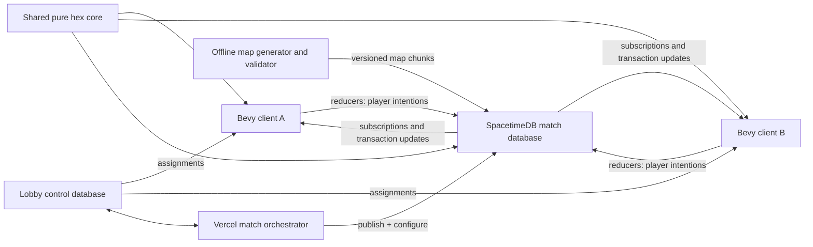

# Technical Architecture

Status: implemented V1 architecture baseline
Last updated: 2026-08-07

This document records the architecture commitments for the first playable version of the game. It deliberately separates those commitments from scaling questions that must be answered with measurements. Gameplay details live elsewhere; this document focuses on authority, state flow, code boundaries, rendering, persistence, and delivery order.

## V1 commitments

- The game ships a Bevy client for native desktop and WebAssembly/WebGPU.
- Platform-dependent code stays behind narrow adapters for native and WebAssembly builds.
- SpacetimeDB is the sole gameplay authority. Clients submit intentions and render subscribed state; they do not run an authoritative lockstep simulation or vote on state hashes.
- Each match runs in its own logical SpacetimeDB database instance. This is isolation inside a SpacetimeDB host, not a requirement for one machine or process per match.
- Local development uses one manually provisioned match database. Production
  uses a lobby control database plus a Vercel orchestrator that publishes one
  logical SpacetimeDB database per user-created match.
- One visible terrain hex is one authoritative gameplay cell. Terrain is static during a V1 match and is stored and rendered in chunks.
- Troops are conserved aggregate strength, not individual infantry entities.
  Cluster waves, explicit front redistribution, Reshape, and combat operate on active
  orders and active front edges rather than per-soldier entities.
- Authoritative calculations use integers or explicit fixed-point values with stable iteration order. Floating point is reserved for client presentation.
- Generated SpacetimeDB bindings define the client/server wire contract. Files
  below `match-bindings/src/module_bindings` are generated and never edited by
  hand; the crate's small handwritten wrapper only exports them and scopes
  lints for generated code.
- V1 ships deterministic 64 x 64, 128 x 128, and 192 x 192 presets through one
  dimension-independent map contract. A 256 x 256 fixture remains an unbuilt
  stretch/load target rather than a supported V1 preset.
- Initial visuals are procedural graybox geometry with clear ownership, elevation, selection, route, and troop-density feedback.

## Version and pinning policy

The implemented and tested V1 toolchain is pinned to:

- Rust 1.95.0, edition 2024;
- Bevy 0.19.0;
- SpacetimeDB CLI, module SDK, client SDK, and binding generator 2.7.1.

The compatibility gate now builds and publishes the Rust module to a local
SpacetimeDB host, generates Rust client bindings, connects native clients, and
receives authoritative subscription updates. Exact versions live in
`rust-toolchain.toml`, both Cargo manifests, and both lockfiles. The helper
scripts reject a mismatched CLI or Rust compiler before publishing or
regenerating the wire contract.

The browser build uses Bevy's WebGPU backend and SpacetimeDB's browser transport.
Connection setup is asynchronous and identity tokens are stored in browser
`localStorage`, scoped by host, database, and profile. Native clients retain the
filesystem-backed credential adapter. Browser compile coverage is part of the
compatibility gate; representative browser graphics, reconnect, download-size,
and map-performance measurements remain required before production release.
Track budgets, scripts, and measured status in
[Browser release gates](./browser-gates.md).

Upgrade Bevy or SpacetimeDB intentionally on a dedicated branch, regenerate
bindings, run migrations if required, and repeat native, web-compile,
reconnect, and load tests.

Useful release references:

- [Bevy 0.19 release](https://bevy.org/news/bevy-0-19/)
- [SpacetimeDB releases](https://github.com/clockworklabs/SpacetimeDB/releases)

## System topology



The client owns input, camera, rendering, local previews, interpolation, and UI. The match database owns player slots, authoritative terrain metadata, ownership, troop strength, orders, routing results, aggregate-flow progress, combat, and victory. The shared core contains deterministic rules used by both sides, but server execution always wins when a client preview differs.

This architecture does not copy OpenFront's client-side lockstep or
client-majority hash model. OpenFront remains interaction and game-design
research only; its cluster-level simplicity informs UX, not authority.
SpacetimeDB transactions and reducers provide the authority boundary suited to
this stack.

## Database topology and match lifecycle

### First playable version

Publish the match module manually as one development database, `of-match-dev` by
default. It hosts exactly one configurable 2–500 player match at a time. This avoids building a
lobby before the cluster conquest loop has been validated.

### Concurrent matches

Production publishes `modules/lobby` as `of-lobby`. The static lobby directory
uses host-issued identities, calls the control reducers through a Vercel
function, and receives a match database assignment. The Vercel orchestrator
publishes the pinned match Wasm through SpacetimeDB's management HTTP API,
configures the requested map and player count, and records the resulting
`of-match-<lobby-id>` name in the control database. The browser preserves its
host-issued token under the assigned match profile before loading the Bevy game.

The control module stores lobby lifecycle, membership, assignments, the module
owner used to authorize orchestration, and bounded provisioning failures.
Archival and retention of completed match databases remain an operational
follow-up; a live match database is never upgraded or cleared by the lobby path.

A logical database per match gives independent state, scheduling, subscriptions, module-version pinning, failure scope, and cleanup. Many such databases may run on one SpacetimeDB host. A single giant multi-match schema is not the default because it couples memory pressure, upgrades, security filters, and failure impact across otherwise independent games.

The match result is small and may be copied to the lobby after completion. The completed match state should become read-only before archival. Do not update a live match to a new module version unless a tested, compatible migration path exists.

## Implemented Cargo workspace

The V1 repository layout is:

```text
Cargo.toml
Cargo.lock
rust-toolchain.toml
crates/
  hex-core/             # Pure deterministic coordinates and game rules
  match-bindings/       # Generated SpacetimeDB Rust client bindings
  game-client/          # Bevy application and platform adapters
  worldgen/             # Deterministic curated-map generation
modules/
  match/                # SpacetimeDB schema, reducers, and scheduling
tools/
  mapgen/               # Offline generation, validation, and baking
  match-e2e/             # Two-identity real-server acceptance smoke
maps/
docs/
scripts/
```

`hex-core` must not depend on Bevy or SpacetimeDB. It owns value types and pure functions for axial/cube coordinates, neighbors, distance, chunk addressing, elevation traversal, connectivity, capacity and edge rules, route-cost primitives, combat math, conquest accounting, and deterministic seeded decisions. Both the module and client may depend on it. Client use is for previews, visualization, and tests, never client authority.

The SpacetimeDB module owns schema-facing wrappers, database queries, identity checks, reducers, transactions, indexes, active-set scheduling, and conversion to and from `hex-core` types. The Bevy client owns ECS presentation types and conversion from generated bindings.

Generate `match-bindings/src/module_bindings` from the locally built match module
schema. Generated files carry a prominent generated marker, are committed, and
are never manually edited. CI regenerates the bindings and fails on an
unexpected diff so schema drift is visible.

Reducer work regressions are gated with the standalone host's deterministic
Wasmtime fuel counter rather than wall-clock timing. Run a scenario against a
fresh isolated database, resolve its identity with `spacetime list --server
local`, then check the cumulative mean with:

```bash
./scripts/check-reducer-fuel.sh <database-identity> simulation_tick <fuel-limit>
./scripts/check-reducer-fuel.sh <database-identity> issue_front_rebalance <fuel-limit>
```

Pin both the Rust and SpacetimeDB versions when comparing fuel baselines.

The cluster-wave, strategic-front, Reshape, and cancellation cutover
changes both persisted schema and the public reducer API. SpacetimeDB
2.7.1 cannot migrate this development schema in place; recreate the local
database and regenerate bindings after pulling the cutover:

```bash
./scripts/publish-local.sh --fresh --confirm-delete-of-match-dev
```

## Authoritative command and state flow

The V1 client sends intentions for:

- joining or reclaiming a player slot;
- changing the global mobilization target;
- expanding complete selected source clusters across their reachable neutral
  perimeters, with one clicked focus;
- attacking the complete selected enemy-cluster union from every shared front;
- moving a selected Share between two strategic fronts of one source cluster;
- best-effort Reshape of one complete source cluster into an owned, passable
  drawn footprint;
- cancelling an exact frozen set of explicit dispatch order IDs.

The client persists one Share percentage and sends it with cluster expansion,
attack, and Front Rebalance. Reshape has no percentage field. A cluster
action's sparse source and target seeds are authority hints only: the module
derives and validates complete current connected components before committing
anything, so a stale or malicious client cannot create a hidden sub-cluster
action.

Cluster selection is client presentation state. It does not cancel, adopt, or
supersede a live allocation. Expand, Attack, Front Rebalance, and Reshape do not
implicitly retask another explicit action. Exact Stop is the primary gesture
that deliberately cancels explicit dispatch IDs snapshotted by the client and
revalidated by the authority.

An intention contains a stable player-scoped command ID. Its reducer verifies
connection identity, player slot, match phase, source ownership, current
component topology, available strength, target/front eligibility, and
rule-specific constraints in one transaction. Accepted intentions create explicit orders. Rejected gameplay intentions create only an idempotent
receipt with a UI-suitable reason; they do not partially mutate gameplay state.

The client never sends resulting troop counts, ownership, casualties, arrival
times, front-rebalance targets, or victory. It may preview them, but the
module computes authoritative results. Visual interpolation is replaceable by
the next subscription update.

A receipt or stable order row keyed by `(player_id, client_command_id)` makes
retries idempotent when a connection disappears after submission but before the
client observes the transaction. Command IDs are player-scoped and monotonic
by client contract; the module keeps a private per-player high-water mark and
treats any ID at or below it as a duplicate. That watermark, not receipt-row
existence, carries dedup correctness, so receipt rows are retained only as a
bounded recent feedback window per player (currently 128 commands) and older
rows are pruned on insert. Terminal Completed/Cancelled orders and their
source/destination rows are likewise pruned after a fixed feedback window
(currently 2,400 steps); Quarantined orders are kept as durable operator
records. Spawn selection, readiness controls, and rematches are outside the
reducer surface.

## Deterministic simulation rules

Authoritative simulation values use integer units or named fixed-point wrappers:

- troop strength and capacity: integer strength units;
- ratios and modifiers: fixed-point basis points or another documented scale;
- elevation: integer levels;
- duration: integer logical ticks;
- map coordinates and stable IDs: integers.

Do not use `f32` or `f64` for authoritative combat, routing cost, capacity, or conquest percentages. Specify rounding direction at each operation, use checked arithmetic where overflow indicates a bug, and test all boundary values.

When processing sets, sort by stable IDs or use ordered collections. Never let hash-map iteration decide combat or congestion priority. Derive randomness from a stored match seed plus stable event identifiers, and record any advanced random-stream state. The scheduler's wall clock wakes the simulation; it does not become an uncontrolled input to combat math.

Keep a logical simulation step counter in database state. A service interruption resumes from stored logical state rather than applying hours of combat instantly. If an optional wall-clock match limit is later enabled, its pause/recovery behavior must be an explicit game-mode rule.

## Aggregate flows, cluster waves, front logistics, and combat

Every infantry point is stationary at a cell, allocated to an aggregate order at
a current cell, or removed as a casualty. There is no row per soldier.

The simulation keeps three different constraints:

- **hex capacity**: strength that may occupy a cell;
- **edge throughput**: strength that may cross an edge per logical second;
- **combat frontage**: strength that may fight across a hostile edge at once.

Approved movement is bounded by queued strength, edge throughput over the
logical step, and destination residual capacity. A two-phase update approves
outgoing flow before atomically applying incoming flow, allowing capacity-safe
pipelines. Capacity-blocked explicit logistics strength remains queued; a best-effort
command may settle strength only where that command's rules allow it. Strength always remains at its real physical cell and is never dropped
or teleported.

The generic execution schema uses `transfer_order`, `transfer_source`,
`transfer_destination`, and `transit_packet`. Source rows account for initial
commitments. Destination rows represent fixed redistribution targets; cluster
waves use private topology rather than persisting one complete path per source
and exit. Packets carry scalar queues at current physical cells. These tables
are an execution substrate, not a public exact-infantry-transfer API.

Each simulation step decodes `transit_packet` once into a transaction-local,
key-ordered packet index with secondary order, cell, and order/destination
lookups. Routes use shared immutable slices inside that index so trim,
branching, movement, combat, and finalization preserve their ordered phase
semantics without repeatedly decoding or cloning every route vector. Packet writes are mirrored to the database immediately, so reducers continue
to observe the current transactional state. Every remaining packet belongs to
an explicit player command and is available through the public packet and route
tables.

### Complete-component authority

`issue_expand_clusters`, `issue_attack_clusters`, `issue_front_rebalance`, and
`issue_reshape` accept sparse seed cells so payload size does not define
gameplay scope. The module rebuilds the complete ground-traversable owned or
enemy components from authoritative ownership, passability, and elevation.
Blocked cells and impassable edges split components; empty owned cells connect
them. Invalid, foreign, or stale seeds reject transactionally.

This complete-component derivation is repeated at reducer acceptance. The
client's materialized cluster selection is therefore a convenience and preview,
not the authority boundary.

### Focused neutral expansion

Expand Clusters computes every eligible neutral exit around every accepted
source component. Sources without a reachable neutral perimeter remain
stationary and do not invalidate other components. Only owned cells directly
touching an eligible neutral exit participate. Each contributes its Share of
stationary action-available infantry once, excluding every explicit allocation.
Interior strength remains stationary and no support corridor is constructed.

The private expansion wave stores a deterministic acyclic outward topology and
the clicked focus cell. At each branch, closer/equal/farther progress receives
a mild 11/10/9 weight. The shared integer
allocator gives eligible branches a positive baseline when sufficient strength
exists, conserves the exact total, merges contributions before later splits, and
rotates remainder priority to avoid permanent branch bias.

Branches move independently under terrain, elevation, throughput, capacity, and
terrain-scaled occupation garrisons. A fast branch may bulge while another
queues. Ownership is rechecked; an exit that has become hostile is not converted
into an implicit attack.

### Enemy-cluster attack

Attack Clusters expands every target seed to its complete same-owner enemy
component and snapshots the sorted union as an immutable target mask. The
authority starts from every passable edge shared by accepted source and target
clusters, not one global direction or one chosen arc. Only infantry already on
the owned cells of those edges is eligible; the attack never pulls inland troops.

The target mask is represented as a deterministic acyclic progression from all
initial shared fronts. Captures reveal the next masked neighbors; local
progression can turn with the boundary, split at several successors, and merge
where fronts meet. Each participating front cell contributes Share once even when it
touches several fronts or targets. A branch cannot enter a cell outside the
accepted mask, so later adjacent territory is never attacked accidentally.

Every step rechecks defender infantry, terrain, elevation, frontage, throughput,
capacity, and remaining garrison cost. Several fronts entering one target share
one defender pool; strength and casualties remain conserved. Cancellation
releases surviving packets where they physically are rather than rewinding
captures.

Contested-cell resolution is simultaneous across **all** attacking owners: the
kernel allocates the defender pool proportionally over every valid attacking
edge regardless of owner (largest-remainder rounding, attack-ID tie-break),
so three-way contests need no module-side owner ordering. When the defender is
eliminated, the capture rule is: the attacking owner with the largest total
surviving committed strength at the cell captures, ties break toward the
smaller owner ID; within the winning owner, the largest surviving front
captures, ties break toward the smaller origin cell ID. Losing owners keep
their survivors in place and contest the cell again next step. A malformed
front (non-adjacent origin, impassable cliff, duplicated origin) is rejected
individually — the remaining valid fronts still resolve, and the orders behind
the rejected front are quarantined.

### Explicit strategic-front redistribution

A strategic front is derived from directed deployable boundary edges of one
complete owned traversable component. Hostile runs are labeled by opponent;
neutral runs between hostile runs against the same opponent bridge those runs.
Different opponents split hostile frontage. Neutral-facing edges are grouped by
the actual bounding hostile front **instances** around each geometric perimeter
cycle — not merely by the bounding opponents' IDs — so geometrically
disconnected neutral arcs that happen to sit between the same pair of opponent
IDs stay separate fronts. Repeated
contact with the same hostile front does not split the neutral frontage, while
neutral sections bounded on opposite sides by different hostile fronts remain
independent. Neutral bridge edges remain members of their neutral front, so
strategic fronts may overlap at edges and owned source cells. Off-map,
terrain-disconnected edges are ignored markers on the geometric perimeter and
never appear in emitted fronts. Derivation walks complete perimeter cycles,
uses sorted integer inputs, and produces no durable front ID in the first
implementation.

`issue_front_rebalance` receives owned component seeds, source/target front
seeds, Share basis points, and an exact optional supersede set. Authority closes
the seeds over the current complete component, re-derives both fronts, and
rejects stale or same-front gestures before changing orders. It snapshots Share
once from movable source-front infantry. Live unrelated action packets remain
fixed and consume physical capacity.

Cross-front allocation is an explicit player choice: fronts have equal default
strategic importance, and a long front does not automatically claim more of the
cluster-wide force. Within the chosen target front, exposed edge count and
physical headroom weight deterministic capacity-safe target placement. Routing
uses the current terrain graph once and persists aggregate routes and packets;
troops then move physically through the normal movement pipeline.

There is no density-policy schema, reducer, cache, or scheduled maintenance
path. Troop redistribution exists only as explicit Front Rebalance or Reshape
orders.

### Best-effort Reshape and exact Stop

Reshape accepts one complete source cluster and an owned, passable drawn target.
It uses all currently available affected strength, never Share. Deterministic
capacity-safe targets prefer reachable drawn cells. If the target can hold the
pool, movable strength outside drains; if it cannot, the drawing saturates and
conserved overflow stays on source cells outside. Unrelated allocations remain
fixed and reserve capacity. A disconnected source portion without a reachable
target remains unchanged.

The generic `cancel_orders` reducer receives exact active explicit-order IDs
captured by the Stop preview. It revalidates ownership and liveness, then
releases only that snapshot at current cells. Normal selection sends no supersede set, while an
accepted contextual command leaves every unrelated explicit order intact.

Legacy Push Front, unfocused Expand Perimeter, one-shot Formation/Bias, and
retask planning remain compatibility code paths rather than the cluster-first
client contract.

### Scheduled and active-set processing

V1 uses one private SpacetimeDB schedule row per running match. A wake reducer
processes a fixed 250 ms logical step, commits it transactionally, and schedules
the next wake while the match remains running. Movement and combat iterate
active transit packets and the contested edges derived from them; the
provisional one-second population step scans habitable cell state. Pausing the
cadence when a running match is idle is a later measured optimization.

The important commitments are:

- no full-map scan on the movement/combat path; the provisional population scan
  runs only on its slower cadence;
- no update at the Bevy render rate;
- no scheduler row per individual strength unit;
- fixed logical deltas for deterministic rules;
- bounded work with metrics for active orders, edges, fronts, and reducer duration.

Uncontested movement can later be collapsed into scheduled arrival events when doing so preserves congestion and interception semantics. The exact split between periodic active-set updates and calculated arrival events is a scaling experiment, not a V1 rule dependency.

**Failure locality (quarantine).** A scheduled tick is one transaction, so an
error that propagates out of the tick reducer rolls back and the interval
schedule re-runs the identical deterministic state — an unrecoverable per-order
invariant violation would otherwise freeze the match forever. When a violation
is attributable to one order (broken per-order conservation, corrupt persisted
geometry, a rejected combat front, a source-queue underflow), the tick instead
quarantines that order: its packets are deleted with their strength conserved
in place at the current physical cells, its source queues are zeroed, its
private topology rows are removed, the order row is parked with the visible
`Quarantined` status, and an `event=order.quarantine` error is logged. The rest
of the tick proceeds. Truly global failures (logical-step counter overflow,
kernel movement failure across orders, missing singleton state) still
fail-stop the transaction.

## Map data, chunks, and supported sizes

Maps are generated offline from a versioned generator and seed, validated, inspected, and baked into a curated library. Each map has a manifest containing dimensions or bounds, generator version, seed, content hash, spawn candidates, capturable-land mask, and environment metadata. The conquest denominator is fixed from the capturable mask at match initialization.

Authoritative V1 terrain data includes stable cell ID, axial coordinate, integer
elevation, passability, terrain kind, capturability, habitability, and chunk
coordinate. V1 terrain does not mutate. Rivers, fixed crossings, and other
per-edge map features require a later versioned edge-data contract.

Static terrain rows carry a deterministic chunk coordinate; dynamic rows remain
keyed by stable cell ID and map back through terrain. V1 pins 16 x 16 chunks,
while cell identity and gameplay rules remain independent of that choice. The
same partition is useful for:

- loading and subscriptions;
- compact server queries and change tracking;
- Bevy mesh generation and culling;
- dirty-region updates;
- later interest management and level-of-detail work.

The client may repartition subscribed cells into smaller render chunks; the
current combined-mesh implementation uses 8 x 8 render chunks for finer
frustum culling. Storage/subscription and rendering chunk sizes are tuning
parameters and must never become part of gameplay semantics.

The map format must not assume a square world. Initial performance fixtures should include:

- 128 x 128 bounds: 16,384 cells before masking, useful for rapid iteration;
- 192 x 192 bounds: 36,864 cells before masking, nominal V1 target;
- 256 x 256 bounds: 65,536 cells before masking, a future stretch fixture that
  is not currently exposed as a match preset.

V1 has no fog of war, but high-scale clients still use bandwidth-oriented interest. Clients bootstrap with immutable full terrain plus match/player metadata only, then after the authoritative player count and local seat are known issue a one-time tactical subscription: full `cell_state`/`combat_front` and tactical tables at `player_count <= 8`; above that threshold, all local-owned cells globally plus local attacker/defender fronts and player-filtered tactical rows. High-scale remote `CellState` interest is a separate moving spatial subscription around the camera focus chunk (spawn-centered until the camera is available), debounced on server chunk-boundary crossings with a configurable chunk radius on denormalized `chunk_q`/`chunk_r`. Old spatial handles are retired so subscriptions never accumulate; cells leaving interest project to neutral/default. This is bandwidth interest plus local ownership—not security authorization. The tactical handle never repeats the bootstrap query set, and commands stay blocked until bootstrap + tactical have applied. Chunk keys remain first-class so interest radii can be tuned without changing cell identity.

Store the authoritative map hash in the match database. During V1, terrain chunks may also live in database tables for a self-contained join. A later optimization may load a matching immutable baked map locally and subscribe only to authoritative dynamic state, but the client must reject or fetch a map when its local hash differs.

## SpacetimeDB subscriptions and the Bevy cache bridge

On connect, the client first subscribes to match metadata, player projections,
and immutable terrain. After the local seat binds, it adds one tactical
subscription for cell state / combat (full or spatial+local-owned by scale),
active orders, routes/packets, mobilization, and
command receipts. The SpacetimeDB client cache is the network-facing source of
truth for the client.

Full disclosure of gameplay state is intentional in V1: the design has no fog
of war, so every gameplay-relevant table (ownership, orders, packets, routes,
fronts, receipts) is public and readable by every client, and no per-player
read authorization exists. Purely internal execution state — expansion wave
topology and split cursors, garrison debt, retreat abandonments, the identity
index, the lobby configurator record, command watermarks, static edge limits,
and the scheduler row — is private only to cut subscription bandwidth and API
surface, not as a security boundary. This posture must be revisited when fog
of war is introduced.

A narrow adapter advances the SpacetimeDB connection in the Bevy update loop as required by the selected SDK version. It translates inserted, updated, and deleted rows into ordered application events and dirty chunk/cell markers. Bevy systems consume those markers; rendering systems do not synchronously query the network and network callbacks do not directly mutate arbitrary ECS state.

The initial snapshot gates entry into the playable state. Subsequent transaction updates should be applied together so the UI does not briefly render half of an ownership/combat transaction. When practical, maintain dynamic per-cell state in packed arrays keyed by stable cell ID and use Bevy entities for chunks, UI, orders, fronts, and other meaningful objects rather than requiring one material or collider per hex.

## Bevy rendering and interaction

The native client uses Bevy's GPU renderer. Static terrain is chunked combined
geometry with stable cell-to-vertex metadata, so ownership and map-view updates
replace only dirty color attributes. No gameplay hex requires its own material,
collider, or UI node. Close-zoom totals and civilian outlines are batched with
viewport-derived complete-or-hidden LOD.

Picking resolves pointer rays against visible chunk geometry and returns the
deterministic top axial cell on stepped terrain. The primary overlays remain
separable from terrain rendering:

- hovered cell and complete selected-cluster perimeters;
- staged complete enemy target-cluster perimeters;
- focused neutral expansion and current active wave/front edges;
- front-rebalance and Reshape targets;
- complete Reshape brush footprint, including unavailable and out-of-world
  cells;
- active packet queues, combat pressure, congestion, and blocked movement.

Map-view shading is presentation only. Overview, Soldiers, and Civilians use
stable reference values rather than the live map maximum. Contested color blends
derive attacker pressure from subscribed fronts without changing the cell's
single authoritative controller.

### Interaction state

The client materializes selected cells for V1, but `C`, its modifiers, and
Select All always produce complete owned passable clusters. A reconciliation
pass absorbs cluster growth and merges and retains all owned children after a
split. Selection never stores a contested retask handle or active-order
ownership.

With sources selected, idle left-click dispatches from map ownership: neutral
means focused whole-perimeter expansion and enemy means complete-cluster attack.
Target staging stores complete enemy components. The Reshape brush exists only in single-cluster Reshape mode; idle
left-drag is not a source-paint operation. Stop is the only state that snapshots
explicit dispatch order IDs.

The contextual HUD is a compact text strip, not a command-button grid. It shows
Share for expansion, attack, and Front Rebalance, and the exact keys for target
staging, front selection, Reshape, Stop, cancellation, or
submission. `?` toggles the full field manual.

All command payloads are revalidated by the authority. The 32,768-cell
materialized-selection cap prevents unbounded preview heatmaps and payloads.
A later world-scale client should represent selections as symbolic component or
chunk masks rather than changing cluster semantics.

### Preview and frame-work bounds

Whole-cluster interaction must not multiply pathfinding by the number of
possible fronts. Focused expansion derives its reachable perimeter and shared
branch weights once. Cluster attack enumerates all shared fronts once and uses
one immutable target-mask topology. Previews cache by selection, cell-state,
active-order, and retask revisions.

Rendering work remains viewport-bounded: dirty visible chunks update first,
selection and target outlines inspect visible render chunks, and hidden chunks
converge under budgets. Authoritative scheduled work remains active-order and
active-front driven. Native-only credentials, windowing, and startup behavior
stay behind narrow adapters; browser delivery remains a later qualification
gate tracked in [Browser release gates](./browser-gates.md).

## Reconnect and recovery

Keep these identities distinct even though V1 supports 2–500 human players:

- connection/account identity;
- match player slot (`u16`, neutral 0);
- territory owner or faction ID.

A reconnect reducer reclaims an existing player slot using authenticated identity and explicit match rules. Disconnection does not delete troops, cancel orders, transfer ownership, or imply immediate defeat. Any timeout or surrender behavior belongs to the game mode, not the transport layer.

On reconnect, the client discards speculative presentation state, rebuilds from
a fresh authoritative subscription snapshot, then resumes active orders and
fronts. The server makes a repeated stable command ID idempotent. The V1 client
does not automatically retry an outcome it did not observe; it reports that
uncertainty, rebuilds authoritative state, and advances beyond all observed
command IDs. UI-only preferences may remain local; no gameplay-critical state
may exist only in Bevy.

Simulation progress needed after a host restart is stored in tables: logical
step, active orders, transit routes and queues, private
cluster-wave topology/focus/target masks and split cursors, sparse
capture-garrison debt, fronts, the scheduled wake, match phase, and map seed.
The persisted scheduled row resumes the fixed logical cadence. Explicit repair
of a missing schedule row and duplicate-wake fault injection remain
reliability-hardening work.

## Testing and performance gates

### Pure rule tests

`hex-core` receives unit and property tests for coordinate conversion,
neighbors, chunk boundaries including negative coordinates, elevation
traversal, connectivity, complete-component derivation, branch classification,
weighted integer quotas, rotating split fairness, route cost, fixed-point
rounding, capacity, flow conservation, multi-edge defense allocation, capture,
and 80% Conquest calculation.

High-value invariants include:

- total strength equals spawned strength minus casualties;
- no cell exceeds capacity after a transaction;
- no flow crosses an impassable edge;
- no defender is counted twice in one logical step;
- equal seed, state, command order, and logical ticks produce equal output;
- invalid or duplicate commands do not change state twice.

### Module and client integration

The headless two-identity smoke covers join, match start, subscription,
idempotent receipts, cluster expansion/attack and front-rebalance reducers, conserved
movement, exact selected-order cancellation, and token-based reconnect.
Deterministic module and client cases pin complete-component authority,
focused all-side allocation, immutable attack masks, multi-front progression,
perimeter-local Share accounting and live-packet exclusion,
best-effort Reshape, shared-child merging, and asynchronous split fairness.
Command rejection, simultaneous hostile orders, full Conquest
completion, schedule fault injection, and completed-match immutability remain
integration-test extensions; pure rule tests cover their deterministic building
blocks where applicable.

Run the headless smoke against a fresh local match database. A native Bevy launch
and two-window connection smoke complement it. Generated-binding CI detects
stale output; WASM remains outside the native V1 gate.

### Initial load targets

Use reproducible seeds and scripted command traces. Targets are engineering gates, not claims about final worldwide maps:

- nominal: a roughly 192 x 192 map, 500 concurrent aggregate orders, and 250 active hostile edges;
- stretch: a 256 x 256 map, 1,000 concurrent aggregate orders, and 500 active hostile edges;
- no simulation work proportional to every map cell when only a small active set changes;
- on the selected reference server, nominal active-step processing stays below one quarter of the configured simulation interval at p95, and stretch stays below one half;
- on the selected reference desktop, the nominal map renders at 60 FPS during ordinary interaction and applies large subscription updates without sustained frame stalls;
- a 30-minute soak includes repeated disconnect/reconnect cycles and scheduler recovery.

Record reducer duration, rows read/written, active-set size, subscription bytes, client dirty-cell count, mesh rebuild time, frame time, and memory. Choose the internal simulation cadence, chunk size, routing cache, and event/tick split from these measurements.

## Asset and UI production workflow

The gameplay vertical slice uses procedural primitives, code-defined colors,
and simple icons. Production assets are not a prerequisite for validating the
cluster-control, congestion, combat, or conquest loop.

When custom assets or UI exploration begins:

1. Codex writes a versioned, provider-neutral brief with style, scale, palette, dimensions, polygon budget, filenames, and acceptance criteria.
2. Grok 4.5 runs headlessly against that bounded brief and a scoped working directory.
3. Concept art and UI boards are saved as source references, not treated as implementation truth.
4. For 3D work, Grok produces a deterministic Blender Python script; Blender runs headlessly and exports GLB plus turntable previews.
5. Automated checks validate units, transforms, origins, materials, texture bounds, polygon counts, filenames, and Bevy loading.
6. Store the brief, provider/model metadata, source script, preview, export, license/provenance information, and validation result together.

If Grok is unavailable, unreliable, or out of credits, use `gpt-5.6-sol` subagents and the normal Codex workflow against the same briefs and acceptance checks. Provider-specific output must never become an undocumented build dependency.

## Vertical-slice delivery order

1. **Compatibility gate:** pin the tested Rust, Bevy, SpacetimeDB, and code-generation toolchain; prove native connection and generated bindings. Browser/WASM compatibility is a later gate.
2. **Workspace skeleton:** create `hex-core`, match module, generated-bindings crate, Bevy client, map tool, formatting/lint/test CI, and one tiny deterministic fixture map.
3. **Network walking skeleton:** manually publish one match database; connect the configured native clients; claim every player slot; mutate one test cell through a validated reducer and subscription.
4. **Map interaction slice:** load authoritative chunked terrain, render stepped
   graybox hexes, implement camera and height-aware picking, and select complete
   owned clusters with multi-select and Select All.
5. **Troop-flow slice:** add cell capacity, focused neutral expansion,
   target-masked enemy-cluster attack, complete-component authority,
   perimeter-local Share branching waves, explicit Front Rebalance, best-effort
   single-cluster Reshape, terrain-scaled garrisons, congestion, density
   shading, front/target previews, and ETA feedback.
6. **Conflict slice:** add hostile edges, combat frontage, capture, elevation modifiers, disconnected components, and the Conquest win condition at 80% of capturable land.
7. **Reliability slice:** add command idempotency, reconnect/reclaim, snapshot rebuild, scheduler recovery, deterministic replay fixtures, and completed-match handling.
8. **Scale slice:** validate the 128 and 192 presets; retain 256, high-order-count traces, profiling, and soak gates as post-slice performance work.
9. **Playable V1 pass:** curate several generated maps, improve contextual
   cluster-action and front-rebalance legibility, add match setup/result screens, and use
   the asset workflow only where graybox presentation blocks evaluation.

Each stage should leave a playable or executable end-to-end path. Do not build the lobby/orchestrator, production art pipeline, or speculative unit systems before the two-client troop-flow slice is measurable and understandable.

## Future scaling research, not V1 commitments

The following questions stay open until profiling or playtesting supplies evidence:

- Exact chunk dimensions and whether terrain rendering uses combined meshes, instancing, GPU buffers, or a hybrid.
- Full-map subscriptions versus chunk interest management for maps beyond the initial stretch target.
- Database-host capacity: simultaneous match instances per host, provisioning latency, archival cost, and placement strategy.
- One match-level scheduler wake versus sharded active-chunk wakes, and when uncontested flows can become calculated arrival events.
- Routing strategy under congestion: cached paths, flow fields, hierarchical regions, explicit player routes, and replan thresholds.
- Packet compaction: first-hop expansion packets retain `origin_cell` until
  movement so source queues, cancellation, and casualties remain attributable.
  They cannot be merged across origins by changing only the packet key. Profile
  large cluster waves and consider a separate source-accounting redesign before
  coalescing those rows; shared downstream expansion topology is already
  aggregated with `EXPANSION_AGGREGATE_ORIGIN`.
- Static map delivery through database rows versus content-addressed baked assets with hash verification.
- Region-level summaries and level of detail for maps intended to represent a whole world.
- Browser delivery, WebGPU/WebGL compatibility, download size, threading limits, and browser-specific SpacetimeDB behavior. WASM portability is retained, but web release work follows native V1. Concrete download, frame-cost, and reconnect budgets live in [Browser release gates](./browser-gates.md) until those measurements close.
- Roads, cities, bridges, destructible infrastructure, additional recruitment structures and policies, fog of war, diplomacy, naval/air movement, and mutable terrain.
- Multi-hex armored formations and deliberate spatial blocking. These remain separate from scalar infantry flow and must be prototyped after V1.
- AI opponents, teams, spectators, matchmaking, and long-term persistence beyond match results.

These research items must not leak speculative complexity into the shared core or V1 schema. Preserve extension points through clear coordinate, movement-profile, relation, map-chunk, and order boundaries; add concrete systems only after the core multiplayer loop is validated.
