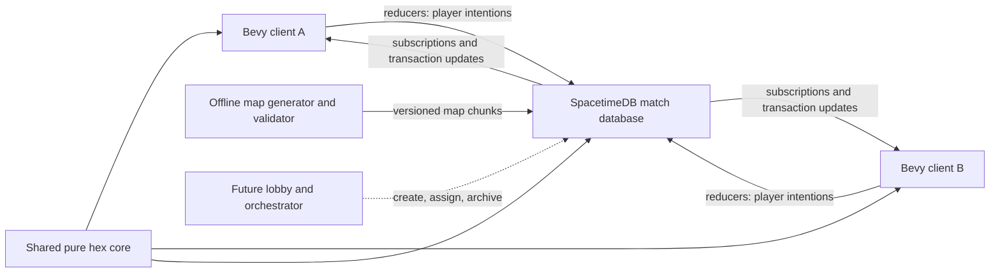

# Technical Architecture

Status: implemented V1 architecture baseline
Last updated: 2026-08-03

This document records the architecture commitments for the first playable version of the game. It deliberately separates those commitments from scaling questions that must be answered with measurements. Gameplay details live elsewhere; this document focuses on authority, state flow, code boundaries, rendering, persistence, and delivery order.

## V1 commitments

- The game ships native desktop first with a Bevy client.
- Platform-dependent code stays behind narrow adapters so the client and shared game logic remain viable for a later WebAssembly build.
- SpacetimeDB is the sole gameplay authority. Clients submit intentions and render subscribed state; they do not run an authoritative lockstep simulation or vote on state hashes.
- Each match runs in its own logical SpacetimeDB database instance. This is isolation inside a SpacetimeDB host, not a requirement for one machine or process per match.
- V1 starts with one manually provisioned development match database. A lobby database and external match orchestrator are added when concurrent public matches are needed.
- One visible terrain hex is one authoritative gameplay cell. Terrain is static during a V1 match and is stored and rendered in chunks.
- Troops are conserved aggregate strength, not individual infantry entities.
  Push Front, redistribution, and combat operate on active orders and active
  front edges rather than scanning every cell.
- Authoritative calculations use integers or explicit fixed-point values with stable iteration order. Floating point is reserved for client presentation.
- Generated SpacetimeDB bindings define the client/server wire contract. Files
  below `match-bindings/src/module_bindings` are generated and never edited by
  hand; the crate's small handwritten wrapper only exports them and scopes
  lints for generated code.
- V1 ships deterministic 64 x 64, 128 x 128, and 192 x 192 presets through one
  dimension-independent map contract. A 256 x 256 fixture remains an unbuilt
  stretch/load target rather than a supported V1 preset.
- Initial visuals are procedural graybox geometry with clear ownership, elevation, selection, route, and troop-density feedback.

## Version and pinning policy

The implemented and tested V1 toolchain is pinned to:

- Rust 1.95.0, edition 2024;
- Bevy 0.19.0;
- SpacetimeDB CLI, module SDK, client SDK, and binding generator 2.7.1.

The compatibility gate now builds and publishes the Rust module to a local
SpacetimeDB host, generates Rust client bindings, connects native clients, and
receives authoritative subscription updates. Exact versions live in
`rust-toolchain.toml`, both Cargo manifests, and both lockfiles. The helper
scripts reject a mismatched CLI or Rust compiler before publishing or
regenerating the wire contract.

The browser remains a later delivery target. Bevy supports web builds, but the
native V1 transport persists credentials through the filesystem and has not yet
been adapted or qualified for browsers. A future web pass must provide a
browser credential store and re-run compile, graphics, networking, reconnect,
download-size, and representative-map performance checks before browser support
is claimed.

Upgrade Bevy or SpacetimeDB intentionally on a dedicated branch, regenerate
bindings, run migrations if required, and repeat native, web-compile,
reconnect, and load tests.

Useful release references:

- [Bevy 0.19 release](https://bevy.org/news/bevy-0-19/)
- [SpacetimeDB releases](https://github.com/clockworklabs/SpacetimeDB/releases)

## System topology



The client owns input, camera, rendering, local previews, interpolation, and UI. The match database owns player slots, authoritative terrain metadata, ownership, troop strength, orders, routing results, aggregate-flow progress, combat, and victory. The shared core contains deterministic rules used by both sides, but server execution always wins when a client preview differs.

This architecture does not copy OpenFront's client-side lockstep or client-majority hash model. OpenFront remains interaction and game-design research only. SpacetimeDB transactions and reducers provide the authority boundary suited to this stack.

## Database topology and match lifecycle

### First playable version

Publish the match module manually as one development database, `of-match-dev` by
default. It hosts exactly one two-player match at a time. This avoids building a
lobby before the Push Front and conquest loop has been validated.

### Concurrent matches

When concurrent sessions are required, add:

- a small control or lobby database containing accounts, queues, invitations, match assignments, module versions, and final results;
- an external orchestrator that creates a logical match database from a pinned module version, initializes its map and settings, and gives both clients the database identity;
- archival and retention policy for completed match databases.

A logical database per match gives independent state, scheduling, subscriptions, module-version pinning, failure scope, and cleanup. Many such databases may run on one SpacetimeDB host. A single giant multi-match schema is not the default because it couples memory pressure, upgrades, security filters, and failure impact across otherwise independent games.

The match result is small and may be copied to the lobby after completion. The completed match state should become read-only before archival. Do not update a live match to a new module version unless a tested, compatible migration path exists.

## Implemented Cargo workspace

The V1 repository layout is:

```text
Cargo.toml
Cargo.lock
rust-toolchain.toml
crates/
  hex-core/             # Pure deterministic coordinates and game rules
  match-bindings/       # Generated SpacetimeDB Rust client bindings
  game-client/          # Bevy application and platform adapters
  worldgen/             # Deterministic curated-map generation
modules/
  match/                # SpacetimeDB schema, reducers, and scheduling
tools/
  mapgen/               # Offline generation, validation, and baking
  match-e2e/             # Two-identity real-server acceptance smoke
maps/
docs/
scripts/
```

`hex-core` must not depend on Bevy or SpacetimeDB. It owns value types and pure functions for axial/cube coordinates, neighbors, distance, chunk addressing, elevation traversal, connectivity, capacity and edge rules, route-cost primitives, combat math, conquest accounting, and deterministic seeded decisions. Both the module and client may depend on it. Client use is for previews, visualization, and tests, never client authority.

The SpacetimeDB module owns schema-facing wrappers, database queries, identity checks, reducers, transactions, indexes, active-set scheduling, and conversion to and from `hex-core` types. The Bevy client owns ECS presentation types and conversion from generated bindings.

Generate `match-bindings/src/module_bindings` from the locally built match module
schema. Generated files carry a prominent generated marker, are committed, and
are never manually edited. CI regenerates the bindings and fails on an
unexpected diff so schema drift is visible.

The sustained-Push, Expand All, and four-preset redistribution cutover changes
both the persisted schema and public reducer API. SpacetimeDB 2.7.1 cannot
migrate this development schema in place; after pulling the cutover, recreate
the local database and regenerate bindings with:

```bash
./scripts/publish-local.sh --fresh --confirm-delete-of-match-dev
```

## Authoritative command and state flow

Clients send intentions such as:

- join or reclaim a player slot;
- set the player's global mobilization target;
- issue or cancel a selected-region directional Push Front order;
- issue or cancel a selected-region neutral-only Expand All order;
- issue a percentage-aware one-shot Balance, oriented Front-load, Core-load, or
  Perimeter-load redistribution order.

Spawn selection, retargeting, reprioritization, readiness controls, and rematches
are not part of the V1 reducer surface.

An intention contains a stable player-scoped command ID. Its reducer verifies
connection identity, player slot, match phase, source ownership, available
strength, active-front or destination validity, and rule-specific constraints
in one transaction. Accepted intentions create or change authoritative orders.
Rejected gameplay intentions create only an idempotent receipt with a
UI-suitable reason; they do not partially mutate gameplay state.

The client never sends a resulting troop count, ownership result, casualty value, arrival time, or victory result. It may predict a path and ETA, but the reducer computes or validates the authoritative route and cost. Visual interpolation is allowed; speculative gameplay state must be clearly replaceable by the next subscription update.

Use a receipt or stable order row keyed by `(player_id, client_command_id)` to make retries idempotent. This matters when a client loses its connection after submission but before observing the committed transaction.

## Deterministic simulation rules

Authoritative simulation values use integer units or named fixed-point wrappers:

- troop strength and capacity: integer strength units;
- ratios and modifiers: fixed-point basis points or another documented scale;
- elevation: integer levels;
- duration: integer logical ticks;
- map coordinates and stable IDs: integers.

Do not use `f32` or `f64` for authoritative combat, routing cost, capacity, or conquest percentages. Specify rounding direction at each operation, use checked arithmetic where overflow indicates a bug, and test all boundary values.

When processing sets, sort by stable IDs or use ordered collections. Never let hash-map iteration decide combat or congestion priority. Derive randomness from a stored match seed plus stable event identifiers, and record any advanced random-stream state. The scheduler's wall clock wakes the simulation; it does not become an uncontrolled input to combat math.

Keep a logical simulation step counter in database state. A service interruption resumes from stored logical state rather than applying hours of combat instantly. If an optional wall-clock match limit is later enabled, its pause/recovery behavior must be an explicit game-mode rule.

## Aggregate flows, Push Front, congestion, and combat

Every troop strength unit is accounted for as stationary, assigned to an aggregate order at a cell, or removed as a casualty. There is no entity or database row per infantry member.

The V1 model distinguishes:

- hex capacity: strength that may be staged in a cell;
- edge throughput: strength per logical second that may cross an edge;
- combat frontage: strength that may engage across a hostile edge at one time.

These share a common strength scale but remain separate values. A city may later increase staging capacity, a road may increase throughput, and a mountain pass may constrain throughput and frontage without conflating all three effects.

The generic aggregate-flow schema retains the implementation names
`transfer_order`, source, destination, and transit packet. An order stores its
owner, sources, destinations, requested and committed amounts, progress totals,
kind, orientation, and status. Transit packets store deterministic routes and
scalar queues. These tables are an execution substrate, not a public precise
infantry-transfer API. Selected-corridor routes are fixed when accepted; a Push
packet may extend only along its stored exact axial ray after capture. V1 has no
order priorities or adaptive mid-route replanning. On each logical step,
approved movement is bounded by:

```text
min(queued strength, edge throughput * step duration, destination free capacity)
```

Movement uses a two-phase calculation: approve outgoing flow first, then commit incoming flow atomically. This permits a full column to advance as a pipeline without violating end-of-step capacity. Opposite flows of identical friendly infantry may be netted rather than pointlessly swapping identities. Overflow stays in the preceding cell and remains visible as congestion; it is never dropped.

Push Front is the primary V1 producer of aggregate flows. Its authoritative
reducer accepts an exact selected cell set, one of six axial directions, and a
commitment in basis points. It requires one six-connected owned source region
and one connected active directional front. A selected cell is part of that
front exactly when `source + direction` is neutral or enemy territory. The
other connected selected cells form its reinforcement corridor; they route to
the front entirely within the submitted selection and do not create outward
lanes. Adjacent directions are never inferred. The authority recomputes all
derived edges and routes, so a client cannot redirect a push by submitting a
visual segment or predicted result.

After the initial edge, each front lane advances through successive cells only
along the stored axial direction. Its committed percentage becomes a fixed
mobile strength pool. Terrain, elevation, throughput, frontage, and resistance
may slow or defeat it, while every capture retains a terrain-scaled garrison
and sends only the surplus onward. Lanes stop independently when exhausted,
blocked, defeated, at the map edge, or manually cancelled. Cancellation
releases remaining allocations where they physically are; it is not a rewind.
The public precise-infantry-transfer reducer has been removed. Exact cell
movement is reserved for possible future discrete tanks, boats, or other units.

Expand All is the neutral-only companion producer. Its reducer accepts one
six-connected owned selection and a basis-point dispatch share, with no
orientation. It snapshots that share from every cell's currently unallocated
infantry once, routes each source within the selection to its nearest eligible
neutral boundary, aggregates contributions locally per boundary, and divides
each boundary pool evenly among its outward exits. Shared concave targets are
deduplicated into one stable lane anchor. Each lane derives its own initial
axial direction and then uses the same sustained throughput, capacity,
elevation, and garrison machinery as Push Front. Runtime ownership is checked
before movement: friendly cells remain valid transit, neutral cells may be
captured, and enemy cells stop and release the lane without combat.

Expand All means every neutral boundary of the submitted six-connected
selection, not every disconnected territory component owned by the player.
`Ctrl/Cmd+A` provides the whole-owned-region gesture when that territory is one
six-connected region; internally movement-isolated parts can proceed only when
each has its own reachable neutral boundary. The 4,096-cell V1 command limit
remains in force; a future world-scale global policy would need symbolic
region/component commands rather than a massive cell payload.

Balance, Front-load, Core-load, and Perimeter-load share one deterministic
integer target allocator. Their basis-point participation value freezes the
unparticipating share of each selected cell's current infantry as a local lower
bound, then redistributes only the participating pool subject to capacity and
exact conservation. Balance uses capacity-relative density, Front-load uses an
axial projection, and the radial presets use distance from the selection's
geometric center. Client previews call the same pure rule, while the module
remains authoritative for routes and execution.

Hostile forces do not coexist in a V1 cell. Combat occurs on active hostile
edges. Frontage limits the committed strength that can participate at once,
and defenders are allocated once across simultaneous hostile edges rather than
duplicated against every attacker. After defenders reach zero, attackers enter
subject to edge throughput and destination capacity, then ownership changes
according to the combat rule. `CellState` retains one controller and one local
infantry stack throughout; `CombatFront` rows expose edge pressure rather than
fractional ownership or dual occupancy.

### Scheduled and active-set processing

V1 uses one private SpacetimeDB schedule row per running match. A wake reducer
processes a fixed 250 ms logical step, commits it transactionally, and schedules
the next wake while the match remains running. Movement and combat iterate
active transit packets and the contested edges derived from them; the
provisional one-second population step scans habitable cell state. Pausing the
cadence when a running match is idle is a later measured optimization.

The important commitments are:

- no full-map scan on the movement/combat path; the provisional population scan
  runs only on its slower cadence;
- no update at the Bevy render rate;
- no scheduler row per individual strength unit;
- fixed logical deltas for deterministic rules;
- bounded work with metrics for active orders, edges, fronts, and reducer duration.

Uncontested movement can later be collapsed into scheduled arrival events when doing so preserves congestion and interception semantics. The exact split between periodic active-set updates and calculated arrival events is a scaling experiment, not a V1 rule dependency.

## Map data, chunks, and supported sizes

Maps are generated offline from a versioned generator and seed, validated, inspected, and baked into a curated library. Each map has a manifest containing dimensions or bounds, generator version, seed, content hash, spawn candidates, capturable-land mask, and environment metadata. The conquest denominator is fixed from the capturable mask at match initialization.

Authoritative V1 terrain data includes stable cell ID, axial coordinate, integer
elevation, passability, terrain kind, capturability, habitability, and chunk
coordinate. V1 terrain does not mutate. Rivers, fixed crossings, and other
per-edge map features require a later versioned edge-data contract.

Static terrain rows carry a deterministic chunk coordinate; dynamic rows remain
keyed by stable cell ID and map back through terrain. V1 pins 16 x 16 chunks,
while cell identity and gameplay rules remain independent of that choice. The
same partition is useful for:

- loading and subscriptions;
- compact server queries and change tracking;
- Bevy mesh generation and culling;
- dirty-region updates;
- later interest management and level-of-detail work.

The client may repartition subscribed cells into smaller render chunks; the
current combined-mesh implementation uses 8 x 8 render chunks for finer
frustum culling. Storage/subscription and rendering chunk sizes are tuning
parameters and must never become part of gameplay semantics.

The map format must not assume a square world. Initial performance fixtures should include:

- 128 x 128 bounds: 16,384 cells before masking, useful for rapid iteration;
- 192 x 192 bounds: 36,864 cells before masking, nominal V1 target;
- 256 x 256 bounds: 65,536 cells before masking, a future stretch fixture that
  is not currently exposed as a match preset.

V1 may subscribe both players to the complete map because there is no fog of war. The protocol and renderer should nevertheless retain chunk keys so larger maps can move to interest subscriptions or region summaries without changing cell identity.

Store the authoritative map hash in the match database. During V1, terrain chunks may also live in database tables for a self-contained join. A later optimization may load a matching immutable baked map locally and subscribe only to authoritative dynamic state, but the client must reject or fetch a map when its local hash differs.

## SpacetimeDB subscriptions and the Bevy cache bridge

On join, the client subscribes to match metadata, its player slot, map manifest/chunks, dynamic cell state, active orders, active fronts, command receipts, and match result. The SpacetimeDB client cache is the network-facing source of truth for the client.

A narrow adapter advances the SpacetimeDB connection in the Bevy update loop as required by the selected SDK version. It translates inserted, updated, and deleted rows into ordered application events and dirty chunk/cell markers. Bevy systems consume those markers; rendering systems do not synchronously query the network and network callbacks do not directly mutate arbitrary ECS state.

The initial snapshot gates entry into the playable state. Subsequent transaction updates should be applied together so the UI does not briefly render half of an ownership/combat transaction. When practical, maintain dynamic per-cell state in packed arrays keyed by stable cell ID and use Bevy entities for chunks, UI, orders, fronts, and other meaningful objects rather than requiring one material or collider per hex.

## Bevy rendering and interaction

The client uses Bevy's GPU-accelerated renderer on native platforms. WebAssembly portability is an architectural boundary and compile target, not a V1 delivery promise.

Render static terrain by chunk using generated geometry, shared meshes/instances, or combined chunk meshes selected through profiling. The architecture must support dirty chunk rebuilds even though V1 terrain is immutable, because ownership overlays and later terrain features may change independently. Avoid allocating a unique material asset for every cell.

The initial material treatment exposes gameplay state clearly:

- flat terrain color and elevation sides;
- ownership tint and border emphasis;
- absolute troop strength as a stable, normalized visual channel;
- alternate Overview and civilian-population map views;
- hover, selected reinforcement region, and exact active-front edges;
- selected-only push routes, direction, commitment, congestion, and ETA;
- active combat/front edges, contested pressure, and blocked paths.

Map-view shading is presentation only. Clamp and interpolate it client-side
from authoritative integer values against stable reference values, not a live
map maximum. Combined chunk meshes retain cell-to-vertex color metadata so a
state update can replace only color attributes. Recolor visible dirty chunks
first and let hidden chunks converge under bounded per-frame budgets. Exact
cell totals use one texture-atlas-backed world-space mesh with viewport-derived
complete-set LOD; do not create one text/UI entity or material per gameplay
cell. The Civilians view similarly batches the exposed edges of connected
populated land into one viewport-bounded mesh. Camera, projection,
visible-chunk, topology, and cell-state signatures must short-circuit unchanged
presentation frames before scanning individual cells. Keep overlays separable
so a future art direction does not require changing simulation state.

For a contested target, the client derives attacker pressure from subscribed
`CombatFront` rows and compares it with the defending local infantry. The
combined terrain mesh blends the controller and attacker colors by that ratio.
This is a scalable presentation channel embedded in existing chunk vertex
colors, not a per-cell UI entity, and it never changes the cell's single
authoritative controller.

Picking should resolve pointer rays to chunks and deterministic hex coordinates
instead of creating a physics collider for every cell. Height-aware picking
must choose the visible top surface in stepped terrain. The current client
materializes selected cells, supports a centered rectangular core with complete
hex-ring dilation, connected owned-component selection, and all-owned
selection, while drawing only exposed edges from visible render chunks. Truly
world-scale selection must move to symbolic chunk masks or region selectors
that the authority revalidates rather than serializing millions of cell IDs.
The UX is expected to iterate; the server intent model should not depend on one
specific gesture.

Bulk selections must not multiply pathfinding work. Push Front derives its
exact directional boundary in shared pure code, validates one source component
and one active-front component, and searches backward only through selected
cells. Expand All derives every eligible neutral boundary in one pass and uses
one multi-source nearest-boundary route tree; sustained packets are indexed by
their stable `(order, lane anchor)` rather than rescanning every packet in a
broad order for one lane. Previews cache results by selection and authoritative
cell-state revisions. Every V1 order preview and reducer rejects selections
above 4,096 cells before building heatmaps, routes, or payloads. This is a
safety bound, not the world-scale selection design. Every authority adapter
must debit only source cells that can reach the accepted front or
redistribution deficit under that order's constraints.

Native-only filesystem, windowing, and startup behavior belongs behind narrow
boundaries where practical. A WASM compile gate is deferred with browser
delivery; native is the only implemented V1 target.

## Reconnect and recovery

Keep these identities distinct even though V1 is two human players:

- connection/account identity;
- match player slot;
- territory owner or faction ID.

A reconnect reducer reclaims an existing player slot using authenticated identity and explicit match rules. Disconnection does not delete troops, cancel orders, transfer ownership, or imply immediate defeat. Any timeout or surrender behavior belongs to the game mode, not the transport layer.

On reconnect, the client discards speculative presentation state, rebuilds from
a fresh authoritative subscription snapshot, then resumes active orders and
fronts. The server makes a repeated stable command ID idempotent. The V1 client
does not automatically retry an outcome it did not observe; it reports that
uncertainty, rebuilds authoritative state, and advances beyond all observed
command IDs. UI-only preferences may remain local; no gameplay-critical state
may exist only in Bevy.

Simulation progress needed after a host restart is stored in tables: logical
step, active orders, transit routes and queues, fronts, the scheduled wake,
match phase, and map seed. The persisted scheduled row resumes the fixed logical
cadence. Explicit repair of a missing schedule row and duplicate-wake fault
injection remain reliability-hardening work.

## Testing and performance gates

### Pure rule tests

`hex-core` receives unit and property tests for coordinate conversion, neighbors, chunk boundaries including negative coordinates, elevation traversal, connectivity, route cost, fixed-point rounding, capacity, flow conservation, simultaneous movement, multi-edge defense allocation, capture, and 80% conquest calculation.

High-value invariants include:

- total strength equals spawned strength minus casualties;
- no cell exceeds capacity after a transaction;
- no flow crosses an impassable edge;
- no defender is counted twice in one logical step;
- equal seed, state, command order, and logical ticks produce equal output;
- invalid or duplicate commands do not change state twice.

### Module and client integration

The V1 headless two-identity smoke covers join, match start, subscription,
idempotent command receipts, sustained multi-layer Push progression,
multi-direction neutral Expand All progression, both cancellation paths, and
token-based reconnect. Command rejection, simultaneous hostile orders, full
Conquest completion, schedule fault injection, and completed-match immutability
remain integration-test extensions; pure rule tests cover their deterministic
building blocks where applicable.

Run the headless smoke against a fresh local match database. A native Bevy launch
and two-window connection smoke complement it. Generated-binding CI detects
stale output; WASM remains outside the native V1 gate.

### Initial load targets

Use reproducible seeds and scripted command traces. Targets are engineering gates, not claims about final worldwide maps:

- nominal: a roughly 192 x 192 map, 500 concurrent aggregate orders, and 250 active hostile edges;
- stretch: a 256 x 256 map, 1,000 concurrent aggregate orders, and 500 active hostile edges;
- no simulation work proportional to every map cell when only a small active set changes;
- on the selected reference server, nominal active-step processing stays below one quarter of the configured simulation interval at p95, and stretch stays below one half;
- on the selected reference desktop, the nominal map renders at 60 FPS during ordinary interaction and applies large subscription updates without sustained frame stalls;
- a 30-minute soak includes repeated disconnect/reconnect cycles and scheduler recovery.

Record reducer duration, rows read/written, active-set size, subscription bytes, client dirty-cell count, mesh rebuild time, frame time, and memory. Choose the internal simulation cadence, chunk size, routing cache, and event/tick split from these measurements.

## Asset and UI production workflow

The gameplay vertical slice uses procedural primitives, code-defined colors, and simple icons. Production assets are not a prerequisite for validating Push Front, congestion, combat, or conquest.

When custom assets or UI exploration begins:

1. Codex writes a versioned, provider-neutral brief with style, scale, palette, dimensions, polygon budget, filenames, and acceptance criteria.
2. Grok 4.5 runs headlessly against that bounded brief and a scoped working directory.
3. Concept art and UI boards are saved as source references, not treated as implementation truth.
4. For 3D work, Grok produces a deterministic Blender Python script; Blender runs headlessly and exports GLB plus turntable previews.
5. Automated checks validate units, transforms, origins, materials, texture bounds, polygon counts, filenames, and Bevy loading.
6. Store the brief, provider/model metadata, source script, preview, export, license/provenance information, and validation result together.

If Grok is unavailable, unreliable, or out of credits, use `gpt-5.6-sol` subagents and the normal Codex workflow against the same briefs and acceptance checks. Provider-specific output must never become an undocumented build dependency.

## Vertical-slice delivery order

1. **Compatibility gate:** pin the tested Rust, Bevy, SpacetimeDB, and code-generation toolchain; prove native connection and generated bindings. Browser/WASM compatibility is a later gate.
2. **Workspace skeleton:** create `hex-core`, match module, generated-bindings crate, Bevy client, map tool, formatting/lint/test CI, and one tiny deterministic fixture map.
3. **Network walking skeleton:** manually publish one match database; connect two native clients; claim two player slots; mutate one test cell through a validated reducer and subscription.
4. **Map interaction slice:** load authoritative chunked terrain, render stepped
   graybox hexes, implement camera and height-aware picking, and select connected
   owned source regions.
5. **Troop-flow slice:** add cell capacity, fixed-pool sustained Push Front and
   neutral-only Expand All orders, authoritative selected-corridor
   routing/validation, scheduled lane-by-lane movement, terrain-scaled
   garrisons, congestion, density shading, exact initial-edge preview, and ETA
   feedback.
6. **Conflict slice:** add hostile edges, combat frontage, capture, elevation modifiers, disconnected components, and the Conquest win condition at 80% of capturable land.
7. **Reliability slice:** add command idempotency, reconnect/reclaim, snapshot rebuild, scheduler recovery, deterministic replay fixtures, and completed-match handling.
8. **Scale slice:** validate the 128 and 192 presets; retain 256, high-order-count traces, profiling, and soak gates as post-slice performance work.
9. **Playable V1 pass:** curate several generated maps, improve Push Front
   legibility and selection UX, add match setup/result screens, and use the
   asset workflow only where graybox presentation blocks evaluation.

Each stage should leave a playable or executable end-to-end path. Do not build the lobby/orchestrator, production art pipeline, or speculative unit systems before the two-client troop-flow slice is measurable and understandable.

## Future scaling research, not V1 commitments

The following questions stay open until profiling or playtesting supplies evidence:

- Exact chunk dimensions and whether terrain rendering uses combined meshes, instancing, GPU buffers, or a hybrid.
- Full-map subscriptions versus chunk interest management for maps beyond the initial stretch target.
- Database-host capacity: simultaneous match instances per host, provisioning latency, archival cost, and placement strategy.
- One match-level scheduler wake versus sharded active-chunk wakes, and when uncontested flows can become calculated arrival events.
- Routing strategy under congestion: cached paths, flow fields, hierarchical regions, explicit player routes, and replan thresholds.
- Push packet compaction: the V1 reducer persists one packet and a duplicated
  route per contributing source cell. Profile the F3 `FLOWS` count, then
  coalesce shared route suffixes or represent the selected corridor as a route
  DAG before raising command limits for world-scale maps.
- Static map delivery through database rows versus content-addressed baked assets with hash verification.
- Region-level summaries and level of detail for maps intended to represent a whole world.
- Browser delivery, WebGPU/WebGL compatibility, download size, threading limits, and browser-specific SpacetimeDB behavior. WASM portability is retained, but web release work follows native V1.
- Roads, cities, bridges, destructible infrastructure, additional recruitment structures and policies, fog of war, diplomacy, naval/air movement, and mutable terrain.
- Multi-hex armored formations and deliberate spatial blocking. These remain separate from scalar infantry flow and must be prototyped after V1.
- AI opponents, teams, spectators, matchmaking, and long-term persistence beyond match results.

These research items must not leak speculative complexity into the shared core or V1 schema. Preserve extension points through clear coordinate, movement-profile, relation, map-chunk, and order boundaries; add concrete systems only after the core two-player loop is validated.
